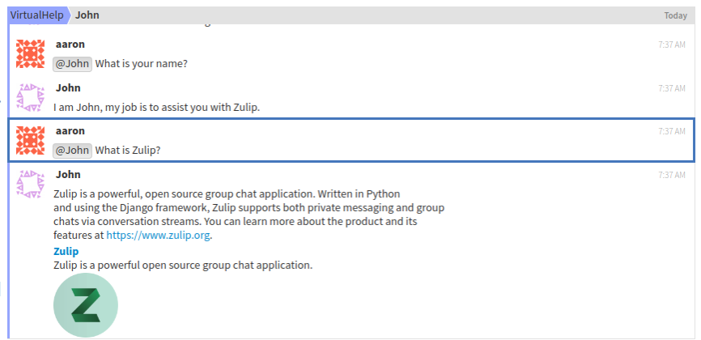

John

Instructions:
You'll have to install chatterbot to use this bot.
Please run: pip install chatterbot on your command line.
The script will need to download some NLTK packages after running in your
home directory. With the mission of humanizing bot interactions, John aims to be your
virtual assistant at the hour of asking for help in Zulip. John is an
interactive bot that uses machine learning heuristics to simulate a
conversation with the user. He has a great sense of humor and
is also powered by Open Source code!

How it works?
John is initially trained with Corpus files, or large text files.
Dialogues are loaded into a json "database", he will try to follow them
once it receives input from a user. John will query the database and
try to find the response that best matches the input according to the Levenshtein distance
which is a string metric for measuring the difference between two sequences. If several
responses have the same acurracy, he will choose one at random.

Can he learn by himself?
John's engine allows him to learn from his conversations with people. However,
without strict supervision bots that learn from people can do harm, so learning
is currently restricted to his initial corpus.

