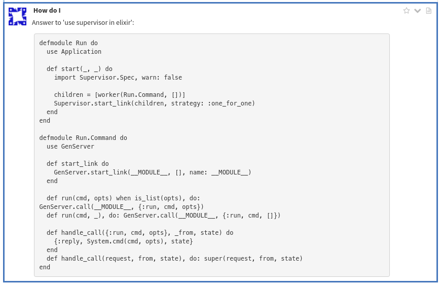
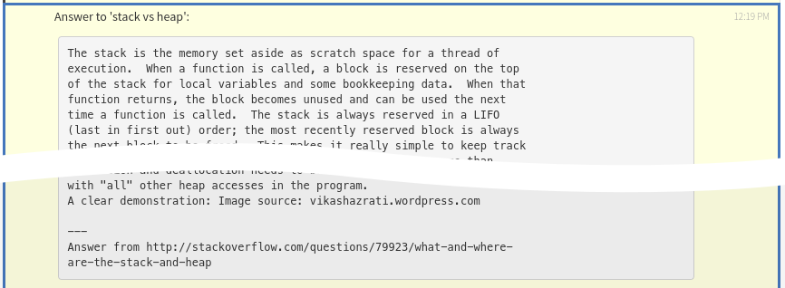

# Howdoi bot

This bot will allow users to get technical answers from
[StackOverflow](https://stackoverflow.com). It is build on top of the
python command line tool [howdoi](https://github.com/gleitz/howdoi) by
Benjamin Gleitzman.

## Usage

Simply prepend your questions with one of the following commands. The
answer will be formatted differently depending the chosen command.

| Command     | Respond                                                |
| ----------- | ------------------------------------------------------ |
| `@howdowe`  | Concise answer to the same stream.                     |
| `@howdowe!` | Same as `@howdowe` but with full answer and URL of the solutions. |
| `@howdoi`   | Concise answer replied to sender via private message.  |
| `@howdoi!`  | Same as `@howdoi` but with full answer and URL of the solutions. |

## Screenshots

#### Example 1

Question -> `@howdowe use supervisor in elixir`

  

Answer ->  Howdoi would try to **only** respond with the coding section
of the answer.

  

#### Example 2

Question -> `@howdoi! stack vs heap`

  

Answer -> Howdoi would return the **full** stackoverflow answer via
**private message** to the original sender. The URL of the answer can be
seen at the bottom of the message.

  

**Note:**

* Line wrapped is enabled with a maximum line length of 85 characters.
This could be adjusted in the source code (`HowdoiHandler.MAX_LINE_LENGTH`).

* *Howdoi* generally perform better if you ask a question using keywords
instead of a complete sentences (eg: "How do i make a decorator in Python"
-> "python decorator").

* __[*Limitation*]__ If a answer contains multiple code blocks, the `@howdoi`
and `@howdowe` commands would only return the first coding section, use
`@howdo[we|i]!` in that case.
