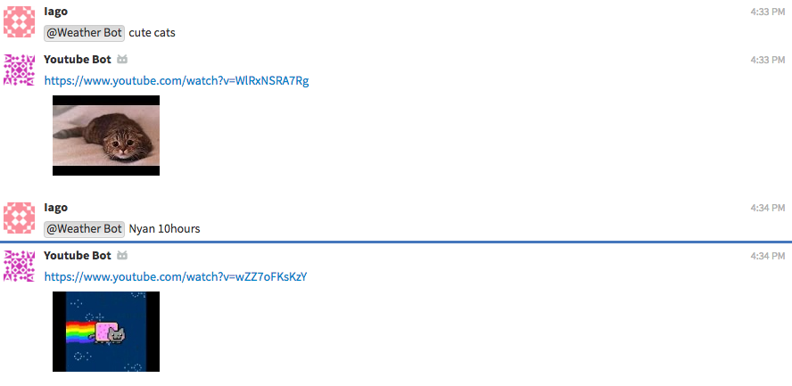

# Youtube bot

Youtube bot is a Zulip bot that can fetch first video from youtube
search results for a specified term. To use youtube bot you can simply
call it with `@mention-bot` followed by a command. Like this:

```
@mention-bot <search term>
```


