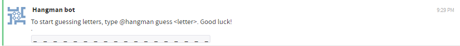
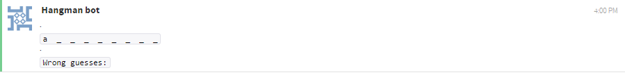
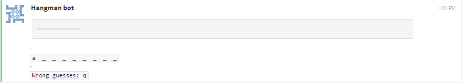
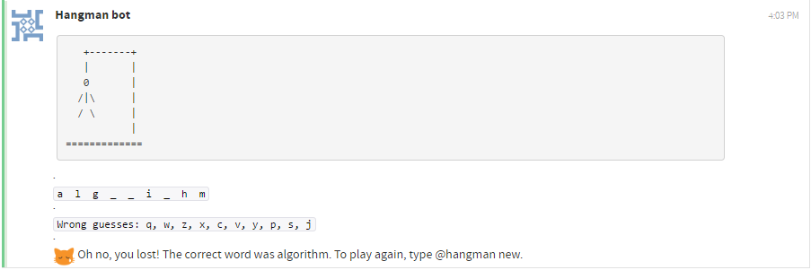
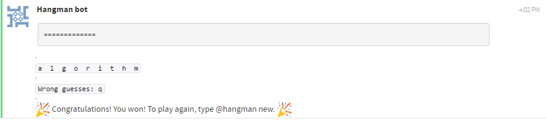

# Hangman bot

Hangman bot is a bot that the user can play Hangman with. It is recommended
to only have the Hangman bot in one stream, to avoid people from one stream
playing a Hangman game that got created in another stream and to avoid
multiple streams being spammed with Hangman messages.

## How to play

1) To start a new Hangman game, simply type `@hangman new`. If there is
already a Hangman game active, either continue with that game or type
`@hangman stop` to stop the game. Before typing `@hangman stop`, make
sure no one is actively playing the current Hangman game. The bot should
send the following after you type `@hangman new`:

2) Once the game has started you can start guessing letters. You do this
by typing `@hangman guess <letter>`. In this example the word I have to
guess is **algorithm**. If I would type `@hangman guess a`, the
bot would respond with the following:

If I would then type `@hangman guess q`, the bot would respond with the following:

3) The game can end in two ways. You either win or you lose. If you guess 10
incorrect letters you lose. After 10 incorrect guesses, the bot will respond
with the following:

If you guess all of the letters that are in the word you have to guess, you
win. The bot will respond with the following to a win:

