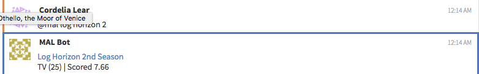

This plugin responds on the same stream and topic with the link of to the anime's
myanimelist page and some details along with it.
It looks for messages starting with '@mal'.

## Setup
* Make a myanimelist account [here](https://myanimelist.net/register.php?from=%2F) if you don't already have one.
* Make a file at `~/.myanimelist-credentials` with the following content (inserting your mal username and password at their respective fields.)
```
[myanimelist]
username=
password=
```

### Example Input
```
@mal log horizon
```
### Example Response
```
Log Horizon
TV (25 eps) | Scored 7.83
```


