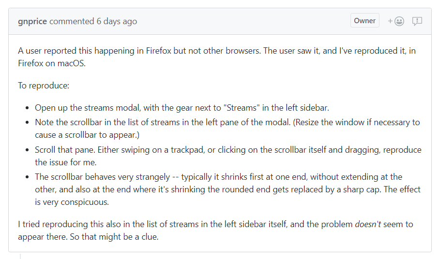
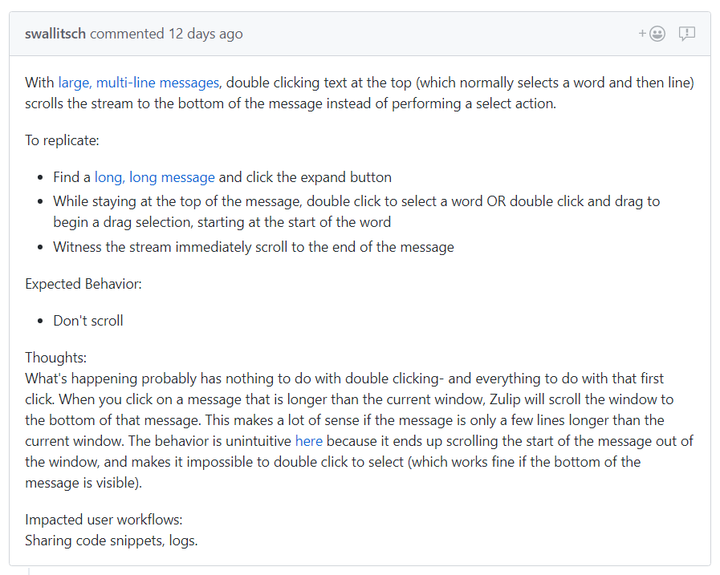

# Bug report guidelines

Please include these elements in your bug report to make it easier for us to help you.

* A brief title

* An explanation of what you were expecting vs. the actual result

* Steps to take in order to reproduce the buggy behavior

* Whether you are using Zulip in production or in the development
environment, and whether these are old versions

* Whether you are using the web app, a desktop app or a mobile device
to access Zulip

* Any additional information that would help: screenshots, GIFs, a
pastebin of the error log

Here are a couple example bug reports, and reasons why they are well written:

[Link to bug report](https://github.com/zulip/zulip/issues/9039)
* Informative title
* Explanation of how to reproduce the bug is explicit and easy to follow
* Explanation of the buggy behavior
* Attempt to reproduce the bug in a different location, to narrow down the
possibilities

[Link to bug report](https://github.com/zulip/zulip/issues/8941)
* Informative title
* Explanation of how to reproduce the bug includes links to specific messages
that make the bug easier to reproduce
* Explanation of the buggy behavior
For more advanced Zulip contributors:
* Includes thoughts on what in Zulip's behavior could be causing the issue
* Includes a mention of the user workflows that are affected by the bug

Further reading:
* [How to write a bug report that will make your engineers love you](https://testlio.com/blog/the-ideal-bug-report/)
* [How to Report Bugs Effectively](https://www.chiark.greenend.org.uk/~sgtatham/bugs.html)
