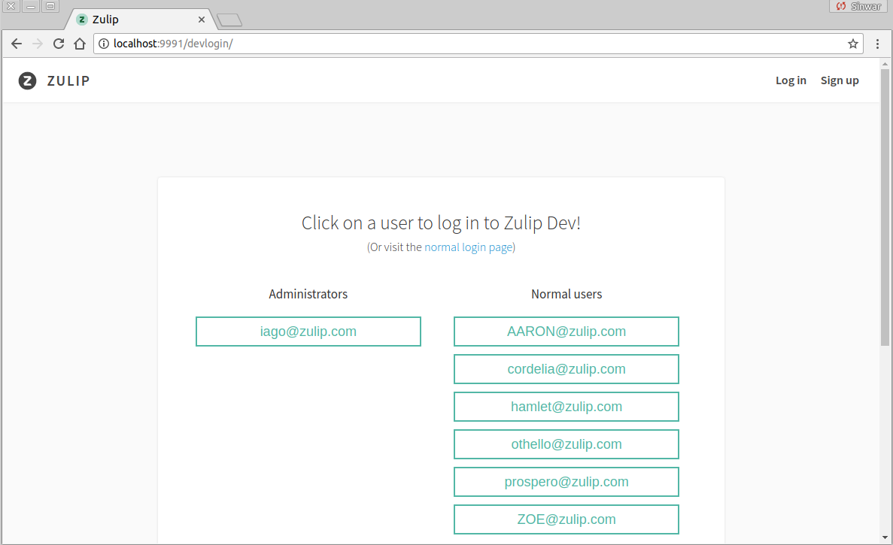

## Vagrant environment setup tutorial

This section guides first-time contributors through installing the
Zulip development environment on Windows, macOS, and Ubuntu.

The recommended method for installing the Zulip development environment is to use
Vagrant with VirtualBox on Windows and macOS, and Vagrant with LXC on
Ubuntu. This method creates a virtual machine (for Windows and macOS)
or a Linux container (for Ubuntu) inside which the Zulip server and
all related services will run.

Contents:
* [Requirements](#requirements)
* [Step 0: Set up Git & GitHub](#step-0-set-up-git-github)
* [Step 1: Install Prerequisites](#step-1-install-prerequisites)
* [Step 2: Get Zulip code](#step-2-get-zulip-code)
* [Step 3: Start the development environment](#step-3-start-the-development-environment)
* [Step 4: Developing](#step-4-developing)
* [Troubleshooting & Common Errors](#troubleshooting-common-errors)
* [Specifying a proxy](#specifying-a-proxy)

**If you encounter errors installing the Zulip development
environment,** check
[Troubleshooting & Common Errors](#troubleshooting-common-errors). If
that doesn't help, please visit
[#provision help](https://chat.zulip.org/#narrow/stream/provision.20help)
in the [Zulip development community server](chat-zulip-org.html) for
real-time help, send a note to the
[Zulip-devel Google group](https://groups.google.com/forum/#!forum/zulip-devel)
or [file an issue](https://github.com/zulip/zulip/issues).

When reporting your issue, please include the following information:

* host operating system
* installation method (Vagrant or direct)
* whether or not you are using a proxy
* a copy of Zulip's `vagrant` provisioning logs, available in
  `/var/log/provision.log` on your virtual machine

### Requirements

Installing the Zulip development environment requires downloading several
hundred megabytes of dependencies. You will need an active internet
connection throughout the entire installation processes. (See [Specifying a
proxy](#specifying-a-proxy) if you need a proxy to access the internet.)


- **All**: 2GB available RAM, Active broadband internet connection, [GitHub account][set-up-git].
- **macOS**: macOS (10.11 El Capitan or 10.12 Sierra recommended), Git,
  [VirtualBox][vbox-dl-macos], [Vagrant][vagrant-dl-macos].
- **Ubuntu**: 14.04 64-bit or 16.04 64-bit, Git, [Vagrant][vagrant-dl-deb], lxc.
  - or **Debian**: 9.0 "stretch" 64-bit
- **Windows**: Windows 64-bit (Win 10 recommended), hardware
  virtualization enabled (VT-X or AMD-V), administrator access,
  [Git for Windows][git-bash] (which installs Git BASH), [VirtualBox][vbox-dl],
  [Vagrant][vagrant-dl-win].

Don't see your system listed above? See [Advanced setup][install-advanced] for
details about installing for other Linux and UNIX platforms.

### Step 0: Set up Git & GitHub

You can skip this step if you already have Git, GitHub, and SSH access
to GitHub working on your machine.

Follow our [Git Guide][set-up-git] in order to install Git, set up a
GitHub account, create an SSH key to access code on GitHub
efficiently, etc.  Be sure to create an ssh key and add it to your
GitHub account using
[these instructions](https://help.github.com/articles/generating-an-ssh-key/).

### Step 1: Install Prerequisites

Jump to:

* [macOS](#macos)
* [Ubuntu](#ubuntu)
* [Debian](#debian)
* [Windows](#windows-10)

#### macOS

1. Install [Vagrant][vagrant-dl-macos] (1.8.4-1.8.6, do not use 1.8.7).
2. Install [VirtualBox][vbox-dl-macos] (5.1.8).

(For a non-free option, but better performance, you can also use [VMWare
Fusion][vmware-fusion-dl] with the [VMWare Fusion Vagrant
plugin][vagrant-vmware-fusion-dl].)

Now you are ready for [Step 2: Get Zulip Code.](#step-2-get-zulip-code).

#### Ubuntu

The setup for Ubuntu 14.04 Trusty and Ubuntu 16.04 Xenial are the same.

If you're in a hurry, you can copy and paste the following into your terminal
after which you can jump to [Step 2: Get Zulip Code](#step-2-get-zulip-code):

```
sudo apt-get -y purge vagrant && \
wget https://releases.hashicorp.com/vagrant/1.8.6/vagrant_1.8.6_x86_64.deb && \
sudo dpkg -i vagrant*.deb && \
sudo apt-get -y install build-essential git ruby lxc lxc-templates cgroup-lite redir && \
vagrant plugin install vagrant-lxc && \
vagrant lxc sudoers
```

For a step-by-step explanation, read on.

##### 1. Install Vagrant

For both 14.04 Trusty and 16.04 Xenial, you'll need a more recent version of
Vagrant than what's available in the official Ubuntu repositories.

First uninstall any vagrant package you may have installed from the Ubuntu
repository:

```
christie@ubuntu-desktop:~
$ sudo apt-get purge vagrant
```

Now download and install the .deb package for [Vagrant 1.8.6][vagrant-dl-deb]:

```
christie@ubuntu-desktop:~
$ wget https://releases.hashicorp.com/vagrant/1.8.6/vagrant_1.8.6_x86_64.deb

christie@ubuntu-desktop:~
$ sudo dpkg -i vagrant*.deb
```

##### 2. Install remaining dependencies

Now install git and lxc-related packages:

```
christie@ubuntu-desktop:~
$ sudo apt-get install build-essential git ruby lxc lxc-templates cgroup-lite redir
```

##### 3. Install the vagrant lxc plugin:

```
christie@ubuntu-desktop:~
$ vagrant plugin install vagrant-lxc
Installing the 'vagrant-lxc' plugin. This can take a few minutes...
Installed the plugin 'vagrant-lxc (1.2.1)'!
```

If you encounter an error when trying to install the vagrant-lxc plugin, [see
this](#nomethoderror).

##### 4. Configure sudo to be passwordless

Finally, [configure sudo to be passwordless when using Vagrant LXC][avoiding-sudo]:

```
christie@ubuntu-desktop:~
$ vagrant lxc sudoers
[sudo] password for christie:
```

If you encounter an error running `vagrant lxc sudoers`, [see
this](#permissions-errors).

Now you are ready for [Step 2: Get Zulip Code.](#step-2-get-zulip-code)

#### Debian

The setup for Debian 9.0 "stretch" is just like [for Ubuntu 16.04](#ubuntu),
with one difference.

If you're in a hurry, you can copy and paste the following into your terminal
after which you can jump to [Step 2: Get Zulip Code](#step-2-get-zulip-code):

```
sudo apt-get -y purge vagrant && \
wget https://releases.hashicorp.com/vagrant/1.8.6/vagrant_1.8.6_x86_64.deb && \
sudo dpkg -i vagrant*.deb && \
sudo apt-get -y install build-essential git ruby lxc redir && \
vagrant plugin install vagrant-lxc && \
vagrant lxc sudoers
```

For a step-by-step explanation, follow the [Ubuntu instructions above](#ubuntu),
with the following difference: in "2. Install remaining dependencies", the
command is

```
sudo apt-get install build-essential git ruby lxc redir
```


#### Windows 10

1. Install [Git for Windows][git-bash], which installs *Git BASH*.
2. Install [VirtualBox][vbox-dl] (version >= 5.1.6).
3. Install [Vagrant][vagrant-dl-win] (version 1.8.4-1.8.6, do not use 1.8.7).

(Note: While *Git BASH* is recommended, you may also use [Cygwin][cygwin-dl].
If you do, make sure to **install default required packages** along with
**git**, **curl**, **openssh**, and **rsync** binaries.)

Also, you must have hardware virtualization enabled (VT-X or AMD-V) in your
computer's BIOS.

#### Running Git BASH as an administrator

It is important that you **always run Git BASH with administrator
privileges** when working on Zulip code, as not doing so will cause
errors in the development environment (such as symlink creation). You
might wish to configure your Git BASH shortcut to always run with
these privileges enabled (see this [guide][bash-admin-setup] for how
to set this up).

##### Enable native symlinks

The Zulip code includes symbolic links (symlinks). By default, native Windows
symlinks are not enabled in either Git BASH or Cygwin, so you need to do a bit
of configuration. **You must do this before you clone the Zulip code.**

In **Git for BASH**:

Open **Git BASH as an administrator** and run:

```
$ git config --global core.symlinks true
```

Now confirm the setting:

```
$ git config core.symlinks
true
```

If you see `true`, you are ready for [Step 2: Get Zulip
Code.](#step-2-get-zulip-code)

Otherwise, if the above command prints `false` or nothing at all, then symlinks
have not been enabled.

In **Cygwin**:

Open a Cygwin window **as an administrator** and do this:

```
christie@win10 ~
$ echo 'export "CYGWIN=$CYGWIN winsymlinks:native"' >> ~/.bash_profile
```

Next, close that Cygwin window and open another. If you `echo` $CYGWIN you
should see:

```
christie@win10 ~
$ echo $CYGWIN
winsymlinks:native
```

Now you are ready for [Step 2: Get Zulip Code.](#step-2-get-zulip-code)

### Step 2: Get Zulip Code

1. In your browser, visit <https://github.com/zulip/zulip>
   and click the `fork` button. You will need to be logged in to GitHub to
   do this.
2. Open Terminal (macOS/Ubuntu) or Git BASH (Windows; must
   **run as an Administrator**).
3. In Terminal/Git BASH, clone your fork:
```
git clone git@github.com:YOURUSERNAME/zulip.git
```

This will create a 'zulip' directory and download the Zulip code into it.

Don't forget to replace YOURUSERNAME with your git username. You will see
something like:

```
christie@win10 ~
$ git clone git@github.com:YOURUSERNAME/zulip.git
Cloning into 'zulip'...
remote: Counting objects: 73571, done.
remote: Compressing objects: 100% (2/2), done.
remote: Total 73571 (delta 1), reused 0 (delta 0), pack-reused 73569
Receiving objects: 100% (73571/73571), 105.30 MiB | 6.46 MiB/s, done.
Resolving deltas: 100% (51448/51448), done.
Checking connectivity... done.
Checking out files: 100% (1912/1912), done.`
```

Now you are ready for [Step 3: Start the development
environment.](#step-3-start-the-development-environment)

### Step 3: Start the development environment

Change into the zulip directory and tell vagrant to start the Zulip
development environment with `vagrant up`.

```
christie@win10 ~
$ cd zulip

christie@win10 ~/zulip
$ vagrant up
```

The first time you run this command it will take some time because vagrant
does the following:

- downloads the base Ubuntu 14.04 virtual machine image (for macOS and Windows)
  or container (for Ubuntu)
- configures this virtual machine/container for use with Zulip,
- creates a shared directory mapping your clone of the Zulip code inside the
  virtual machine/container at `~/zulip`
- runs the `tools/provision` script inside the virtual machine/container, which
  downloads all required dependencies, sets up the python environment for
  the Zulip development server, and initializes a default test
  database.  We call this process "provisioning", and it is documented
  in some detail in our [dependencies documentation](dependencies.html).

You will need an active internet connection during the entire
process. (See [Specifying a proxy](#specifying-a-proxy) if you need a
proxy to access the internet.) `vagrant up` can fail while
provisioning if your Internet connection is unreliable.  To retry, you
can use `vagrant provision` (`vagrant up` will just boot the guest
without provisioning after the first time).  Other common issues are
documented in the
[Troubleshooting & Common Errors](#troubleshooting-common-errors)
section.  If that doesn't help, please visit
[#provision help](https://chat.zulip.org/#narrow/stream/provision.20help)
in the [Zulip development community server](chat-zulip-org.html) for
real-time help.

On Windows, you will see `The system cannot find the path specified.` message
several times. This is expected behavior and is not an error.

Once `vagrant up` has completed, connect to the development
environment with `vagrant ssh`:

```
christie@win10 ~/zulip
$ vagrant ssh
```

You should see something like this on Windows and macOS:

```
Welcome to Ubuntu 14.04.4 LTS (GNU/Linux 3.13.0-85-generic x86_64)

 * Documentation:  https://help.ubuntu.com/

  System information as of Wed May  4 21:45:43 UTC 2016

  System load:  0.61              Processes:           88
  Usage of /:   3.5% of 39.34GB   Users logged in:     0
  Memory usage: 7%                IP address for eth0: 10.0.2.15
  Swap usage:   0%

  Graph this data and manage this system at:
    https://landscape.canonical.com/

  Get cloud support with Ubuntu Advantage Cloud Guest:
    http://www.ubuntu.com/business/services/cloud

0 packages can be updated.
0 updates are security updates.
```

Or something as brief as this in the case of Ubuntu:

```
Welcome to Ubuntu 14.04.1 LTS (GNU/Linux 4.4.0-21-generic x86_64)

 * Documentation:  https://help.ubuntu.com/
```

Congrats, you're now inside the Zulip development environment!

You can confirm this by looking at the command prompt, which starts
with `(zulip-py3-venv)vagrant@`.  If it just starts with `vagrant@`, your
provisioning failed and you should look at the
[troubleshooting section](#troubleshooting-common-errors).

Next, start the Zulip server:

```
(zulip-py3-venv)vagrant@vagrant-ubuntu-trusty-64:/srv/zulip
$ ./tools/run-dev.py
```

You will see several lines of output starting with something like:

```
2016-05-04 22:20:33,895 INFO: process_fts_updates starting
Recompiling templates
2016-05-04 18:20:34,804 INFO: Not in recovery; listening for FTS updates
done
Validating Django models.py...
System check identified no issues (0 silenced).

Django version 1.8
Tornado server is running at http://localhost:9993/
Quit the server with CTRL-C.
2016-05-04 18:20:40,716 INFO     Tornado loaded 0 event queues in 0.001s
2016-05-04 18:20:40,722 INFO     Tornado  95.5% busy over the past  0.0 seconds
Performing system checks...
```
And ending with something similar to:

```
http://localhost:9994/webpack-dev-server/
webpack result is served from http://localhost:9991/webpack/
content is served from /srv/zulip

webpack: bundle is now VALID.
2016-05-06 21:43:29,553 INFO     Tornado  31.6% busy over the past 10.6 seconds
2016-05-06 21:43:35,007 INFO     Tornado  23.9% busy over the past 16.0 seconds
```

Now the Zulip server should be running and accessible. Verify this by
navigating to <http://localhost:9991/> in the browser on your main machine.

You should see something like this:



The Zulip server will continue to run and send output to the terminal window.
When you navigate to Zulip in your browser, check your terminal and you
should see something like:

```
2016-05-04 18:21:57,547 INFO     127.0.0.1       GET     302 582ms (+start: 417ms) / (unauth via ?)
[04/May/2016 18:21:57]"GET / HTTP/1.0" 302 0
2016-05-04 18:21:57,568 INFO     127.0.0.1       GET     301   4ms /login (unauth via ?)
[04/May/2016 18:21:57]"GET /login HTTP/1.0" 301 0
2016-05-04 18:21:57,819 INFO     127.0.0.1       GET     200 209ms (db: 7ms/2q) /login/ (unauth via ?)
```

Now you're ready for [Step 4: Developing.](#step-4-developing)

### Step 4: Developing

#### Where to edit files

You'll work by editing files on your host machine, in the directory where you
cloned Zulip. Use your favorite editor (Sublime, Atom, Vim, Emacs, Notepad++,
etc.).

When you save changes they will be synced automatically to the Zulip
development environment on the virtual machine/container.

Each component of the Zulip development server will automatically
restart itself or reload data appropriately when you make changes. So,
to see your changes, all you usually have to do is reload your
browser.  More details on how this works are available below.

Don't forget to read through the [code style
guidelines](code-style.html#general) for details about how to configure your
editor for Zulip. For example, indentation should be set to 4 spaces rather
than tabs.

#### Understanding run-dev.py debugging output

It's good to have the terminal running `run-dev.py` up as you work since error
messages including tracebacks along with every backend request will be printed
there.

See [Logging](logging.html) for further details on the run-dev.py console
output.

#### Committing and pushing changes with git

When you're ready to commit or push changes via git, you will do this by
running git commands in Terminal (macOS/Ubuntu) or Git BASH (Windows) in the
directory where you cloned Zulip on your main machine.

If you're new to working with Git/GitHub, check out our [Git & GitHub
Guide][rtd-git-guide].

#### Maintaining the development environment

If after rebasing onto a new version of the Zulip server, you receive
new errors while starting the Zulip server or running tests, this is
probably not because Zulip's master branch is broken.  Instead, this
is likely because we've recently merged changes to the development
environment provisioning process that you need to apply to your
development environment.  To update your environment, you'll need to
re-provision your vagrant machine using `vagrant provision` (this just
runs `tools/provision` from your Zulip checkout inside the Vagrant
guest); this should complete in about a minute.

After provisioning, you'll want to
[(re)start the Zulip development server](#step-3-start-the-development-environment).

If you run into any trouble, the
[#provision help](https://chat.zulip.org/#narrow/stream/provision.20help)
in the [Zulip development community server](chat-zulip-org.html) for
is a great place to ask for help.

#### Rebuilding the development environment

If you ever want to recreate your development environment again from
scratch (e.g. to test as change you've made to the provisioning
process, or because you think something is broken), you can do so
using `vagrant destroy` and then `vagrant up`.  This will usually be
much faster than the original `vagrant up` since the base image is
already cached on your machine (it takes about 5 minutes to run with a
fast Internet connection).

Any additional programs (e.g. Zsh, emacs, etc.) or configuration that
you may have installed in the development environment will be lost
when you recreate it.  To address this, you can create a script called
`tools/custom_provision` in your Zulip Git checkout; and place any
extra setup commands there.  Vagrant will run `tools/custom_provision`
every time you run `vagrant provision` (or create a Vagrant guest via
`vagrant up`).

#### Shutting down the development environment for use later

To shut down but preserve the development environment so you can use
it again later use `vagrant halt` or `vagrant suspend`.

You can do this from the same Terminal/Git BASH window that is running
run-dev.py by pressing ^C to halt the server and then typing `exit`. Or you
can halt vagrant from another Terminal/Git BASH window.

From the window where run-dev.py is running:

```
2016-05-04 18:33:13,330 INFO     127.0.0.1       GET     200  92ms /register/ (unauth via ?)
^C
KeyboardInterrupt
(zulip-py3-venv)vagrant@vagrant-ubuntu-trusty-64:/srv/zulip$ exit
logout
Connection to 127.0.0.1 closed.
christie@win10 ~/zulip
```
Now you can suspend the development environment:

```
christie@win10 ~/zulip
$ vagrant suspend
==> default: Saving VM state and suspending execution...
```

If `vagrant suspend` doesn't work, try `vagrant halt`:

```
christie@win10 ~/zulip
$ vagrant halt
==> default: Attempting graceful shutdown of VM...
```

Check out the Vagrant documentation to learn more about
[suspend](https://www.vagrantup.com/docs/cli/suspend.html) and
[halt](https://www.vagrantup.com/docs/cli/halt.html).

#### Resuming the development environment

When you're ready to work on Zulip again, run `vagrant up`. You will also need
to connect to the virtual machine with `vagrant ssh` and re-start the Zulip
server:

```
christie@win10 ~/zulip
$ vagrant up
$ vagrant ssh

(zulip-py3-venv)vagrant@vagrant-ubuntu-trusty-64:/srv/zulip
$ ./tools/run-dev.py
```

### Next Steps

Next, read the following to learn more about developing for Zulip:

* [Git & GitHub Guide][rtd-git-guide]
* [Using the Development Environment][rtd-using-dev-env]
* [Testing][rtd-testing] (and [Configuring Travis CI][travis-ci] to
run the full test suite against any branches you push to your fork,
which can help you optimize your development workflow).

### Troubleshooting & Common Errors

Below you'll find a list of common errors and their solutions.  Most
issues are resolved by just provisioning again (via
`tools/provision.py` inside the Vagrant guest or equivalently `vagrant
provision` from outside).

If these solutions aren't working for you or you encounter an issue not
documented below, there are a few ways to get further help:

* Ask in [#provision help](https://chat.zulip.org/#narrow/stream/provision.20help)
  in the [Zulip development community server](chat-zulip-org.html),
* send a note to the [Zulip-devel Google
  group](https://groups.google.com/forum/#!forum/zulip-devel), or
* [File an issue](https://github.com/zulip/zulip/issues).

When reporting your issue, please include the following information:

* host operating system
* installation method (Vagrant or direct)
* whether or not you are using a proxy
* a copy of Zulip's `vagrant` provisioning logs, available in
  `/var/log/provision.log` on your virtual machine.  If you choose to
  post just the error output, please include the **beginning of the
  error output**, not just the last few lines.

The output of `tools/diagnose` run inside the Vagrant guest is also
usually helpful.

#### Vagrant guest doesn't show (zulip-py3-venv) at start of prompt

This is caused by provisioning failing to complete successfully.  You
can see the errors in `var/log/provision.log`; it should end with
something like this:

```
ESC[94mZulip development environment setup succeeded!ESC[0m
```

The `ESC` stuff are the terminal color codes that make it show as a nice
blue in the terminal, which unfortunately looks ugly in the logs.

If you encounter an incomplete `/var/log/provision.log file`, you need to
update your environment. Re-provision your vagrant machine; if the problem
persists, please come chat with us (see instructions above) for help.

After you provision successfully, you'll need to exit your `vagrant ssh`
shell and run `vagrant ssh` again to get the virtualenv setup properly.

#### The box 'ubuntu/trusty64' could not be found

If you see the following error when you run `vagrant up`:

```
The box 'ubuntu/trusty64' could not be found or
could not be accessed in the remote catalog. If this is a private
box on HashiCorp's Atlas, please verify you're logged in via
`vagrant login`. Also, please double-check the name. The expanded
URL and error message are shown below:
URL: ["https://atlas.hashicorp.com/ubuntu/trusty64"]
```

Then the version of `curl` that ships with Vagrant is not working on your
machine. You are most likely to encounter this error on Windows/Cygwin and
macOS.

On **macOS** this error is most likely to occur with Vagrant version 1.8.7 and
is a [known issue](https://github.com/mitchellh/vagrant/issues/7997).

The solution is to downgrade Vagrant to version 1.8.6 ([available
here](https://releases.hashicorp.com/vagrant/1.8.6/)), or to use your system's
version of `curl` instead of the one that ships with Vagrant:

```
sudo ln -nsf /usr/bin/curl /opt/vagrant/embedded/bin/curl
```

On **Windows/Cygwin,** the fix is simple: replace it with the version from
Cygwin.

First, determine the location of Cygwin's curl with `which curl`:

```
christie@win10 ~/zulip
$ which curl
/usr/bin/curl
```
Now determine the location of Vagrant with `which vagrant`:
```
christie@win10 ~/zulip
$ which vagrant
/cygdrive/c/HashiCorp/Vagrant/bin/vagrant
```
The path **up until `/bin/vagrant`** is what you need to know. In the example above it's `/cygdrive/c/HashiCorp/Vagrant`.

Finally, copy Cygwin's curl to Vagrant `embedded/bin` directory:
```
christie@win10 ~/zulip
$ cp /usr/bin/curl.exe /cygdrive/c/HashiCorp/Vagrant/embedded/bin/
```

Now re-run `vagrant up` and vagrant should be able to fetch the required
box file.

#### Vagrant was unable to mount VirtualBox shared folders

For the following error:
```
Vagrant was unable to mount VirtualBox shared folders. This is usually
because the filesystem "vboxsf" is not available. This filesystem is
made available via the VirtualBox Guest Additions and kernel
module. Please verify that these guest additions are properly
installed in the guest. This is not a bug in Vagrant and is usually
caused by a faulty Vagrant box. For context, the command attempted
was:

 mount -t vboxsf -o uid=1000,gid=1000 keys /keys
```

If this error starts happening unexpectedly, then just run:

```
vagrant reload
```

This is equivalent of running a halt followed by an up (aka rebooting
the guest).  After this, you can do `vagrant provision` and `vagrant
ssh`.

#### ssh connection closed by remote host

On running `vagrant ssh`, if you see the following error:

```
ssh_exchange_identification: Connection closed by remote host
```

It usually means the Vagrant guest is not running, which is usually
solved by rebooting the Vagrant guest via `vagrant reload`.  See
[Vagrant was unable to communicate with the guest machine](#vagrant-was-unable-to-communicate-with-the-guest-machine)
for more details.

#### os.symlink error

If you receive the following error while running `vagrant up`:

```
==> default: Traceback (most recent call last):
==> default: File "./emoji_dump.py", line 75, in <module>
==> default:
==> default: os.symlink('unicode/{}.png'.format(code_point), 'out/{}.png'.format(name))
==> default: OSError
==> default: :
==> default: [Errno 71] Protocol error
```

Then Vagrant was not able to create a symbolic link.

First, if you are using Windows, **make sure you have run Git BASH (or Cygwin)
as an administrator**. By default, only administrators can create symbolic
links on Windows.

Second, VirtualBox does not enable symbolic links by default. Vagrant
starting with version 1.6.0 enables symbolic links for VirtualBox shared
folder.

You can check to see that this is enabled for your virtual machine with
`vboxmanage` command.

Get the name of your virtual machine by running `vboxmanage list vms` and
then print out the custom settings for this virtual machine with
`vboxmanage getextradata YOURVMNAME enumerate`:

```
christie@win10 ~/zulip
$ vboxmanage list vms
"zulip_default_1462498139595_55484" {5a65199d-8afa-4265-b2f6-6b1f162f157d}

christie@win10 ~/zulip
$ vboxmanage getextradata zulip_default_1462498139595_55484 enumerate
Key: VBoxInternal2/SharedFoldersEnableSymlinksCreate/srv_zulip, Value: 1
Key: supported, Value: false
```

If you see "command not found" when you try to run VBoxManage, you need to
add the VirtualBox directory to your path. On Windows this is mostly likely
`C:\Program Files\Oracle\VirtualBox\`.

If `vboxmanage enumerate` prints nothing, or shows a value of 0 for
VBoxInternal2/SharedFoldersEnableSymlinksCreate/srv_zulip, then enable
symbolic links by running this command in Terminal/Git BASH/Cygwin:

```
vboxmanage setextradata YOURVMNAME VBoxInternal2/SharedFoldersEnableSymlinksCreate/srv_zulip 1
```

The virtual machine needs to be shut down when you run this command.

#### Connection timeout on `vagrant up`

If you see the following error after running `vagrant up`:

```
default: SSH address: 127.0.0.1:2222
default: SSH username: vagrant
default: SSH auth method: private key
default: Error: Connection timeout. Retrying...
default: Error: Connection timeout. Retrying...
default: Error: Connection timeout. Retrying...

```
A likely cause is that hardware virtualization is not enabled for your
computer. This must be done via your computer's BIOS settings. Look for a
setting called VT-x (Intel) or (AMD-V).

If this is already enabled in your BIOS, double-check that you are running a
64-bit operating system.

For further information about troubleshooting vagrant timeout errors [see
this post](http://stackoverflow.com/questions/22575261/vagrant-stuck-connection-timeout-retrying#22575302).

#### Vagrant was unable to communicate with the guest machine

If you see the following error when you run `vagrant up`:

```
Timed out while waiting for the machine to boot. This means that
Vagrant was unable to communicate with the guest machine within
the configured ("config.vm.boot_timeout" value) time period.

If you look above, you should be able to see the error(s) that
Vagrant had when attempting to connect to the machine. These errors
are usually good hints as to what may be wrong.

If you're using a custom box, make sure that networking is properly
working and you're able to connect to the machine. It is a common
problem that networking isn't setup properly in these boxes.
Verify that authentication configurations are also setup properly,
as well.

If the box appears to be booting properly, you may want to increase
the timeout ("config.vm.boot_timeout") value.
```

This has a range of possible causes, that usually amount to a bug in
Virtualbox or Vagrant.  If you see this error, you usually can fix it
by rebooting the guest via `vagrant reload` (or equivalently, `vagrant
halt` followed by `vagrant up`):

#### Vagrant up fails with subprocess.CalledProcessError

The `vagrant up` command basically does the following:

* Downloads an Ubuntu image and starts it using a Vagrant provider.
* Uses `vagrant ssh` to connect to that Ubuntu guest, and then runs
  `tools/provision`, which has a lot of subcommands that are
  executed via Python's `subprocess` module.  These errors mean that
  one of those subcommands failed.

To debug such errors, you can log in to the Vagrant guest machine by
running `vagrant ssh`, which should present you with a standard shell
prompt.  You can debug interactively by using e.g. `cd zulip &&
./tools/provision`, and then running the individual subcommands
that failed.  Once you've resolved the problem, you can rerun
`tools/provision` to proceed; the provisioning system is designed
to recover well from failures.

The zulip provisioning system is generally highly reliable; the most common
cause of issues here is a poor network connection (or one where you need a
proxy to access the Internet and haven't [configured the development
environment to use it](#specifying-a-proxy).

Once you've provisioned successfully, you'll get output like this:
```
Zulip development environment setup succeeded!
(zulip-py3-venv) vagrant@vagrant-base-trusty-amd64:~/zulip$
```

If the `(zulip-py3-venv)` part is missing, this is because your
installation failed the first time before the Zulip virtualenv was
created.  You can fix this by just closing the shell and running
`vagrant ssh` again, or using `source /srv/zulip-py3-venv/bin/activate`.

Finally, if you encounter any issues that weren't caused by your
Internet connection, please report them!  We try hard to keep Zulip
development environment provisioning free of bugs.

##### `pip install` fails during `vagrant up` on Ubuntu

Likely causes are:

1. Networking issues
2. Insufficient RAM. Check whether you've allotted at least two
gigabytes of RAM, which is the minimum Zulip
[requires](dev-env-first-time-contributors.html#requirements). If
not, go to your VM settings and increase the RAM, then restart
the VM.

##### yarn install warnings

```
$ yarn install
yarn install v0.24.5
[1/4] Resolving packages...
[2/4] Fetching packages...
warning fsevents@1.1.1: The platform "linux" is incompatible with this module.
info "fsevents@1.1.1" is an optional dependency and failed compatibility check. Excluding it from installation.
[3/4] Linking dependencies...
[4/4] Building fresh packages...
$ browserify node_modules/sockjs-client/lib/entry.js --standalone SockJS > node_modules/sockjs-client/sockjs.js
Done in 23.50s.
```

These are warnings produced by spammy third party JavaScript packages.
It is okay to proceed and start the Zulip server.

#### vagrant-lxc errors

##### Permissions errors

When building the development environment using Vagrant and the LXC provider,
if you encounter permissions errors, you may need to `chown -R 1000:$(whoami)
/path/to/zulip` on the host before running `vagrant up` in order to ensure that
the synced directory has the correct owner during provision. This issue will
arise if you run `id username` on the host where `username` is the user running
Vagrant and the output is anything but 1000.  This seems to be caused by
Vagrant behavior; for more information, see [the vagrant-lxc FAQ entry about
shared folder permissions][lxc-sf].


##### NoMethodError

If you see the following error when you try to install the vagrant-lxc plugin:

```
/usr/lib/ruby/2.3.0/rubygems/specification.rb:946:in `all=': undefined method `group_by' for nil:NilClass (NoMethodError)
  from /usr/lib/ruby/vendor_ruby/vagrant/bundler.rb:275:in `with_isolated_gem'
  from /usr/lib/ruby/vendor_ruby/vagrant/bundler.rb:231:in `internal_install'
  from /usr/lib/ruby/vendor_ruby/vagrant/bundler.rb:102:in `install'
  from /usr/lib/ruby/vendor_ruby/vagrant/plugin/manager.rb:62:in `block in install_plugin'
  from /usr/lib/ruby/vendor_ruby/vagrant/plugin/manager.rb:72:in `install_plugin'
  from /usr/share/vagrant/plugins/commands/plugin/action/install_gem.rb:37:in `call'
  from /usr/lib/ruby/vendor_ruby/vagrant/action/warden.rb:34:in `call'
  from /usr/lib/ruby/vendor_ruby/vagrant/action/builder.rb:116:in `call'
  from /usr/lib/ruby/vendor_ruby/vagrant/action/runner.rb:66:in `block in run'
  from /usr/lib/ruby/vendor_ruby/vagrant/util/busy.rb:19:in `busy'
  from /usr/lib/ruby/vendor_ruby/vagrant/action/runner.rb:66:in `run'
  from /usr/share/vagrant/plugins/commands/plugin/command/base.rb:14:in `action'
  from /usr/share/vagrant/plugins/commands/plugin/command/install.rb:32:in `block in execute'
  from /usr/share/vagrant/plugins/commands/plugin/command/install.rb:31:in `each'
  from /usr/share/vagrant/plugins/commands/plugin/command/install.rb:31:in `execute'
  from /usr/share/vagrant/plugins/commands/plugin/command/root.rb:56:in `execute'
  from /usr/lib/ruby/vendor_ruby/vagrant/cli.rb:42:in `execute'
  from /usr/lib/ruby/vendor_ruby/vagrant/environment.rb:268:in `cli'
  from /usr/bin/vagrant:173:in `<main>'
```

And you have vagrant version 1.8.1, then you need to patch vagrant manually.
See [this post](https://github.com/mitchellh/vagrant/issues/7073) for an
explanation of the issue, which should be fixed when Vagrant 1.8.2 is released.

In the meantime, read [this
post](http://stackoverflow.com/questions/36811863/cant-install-vagrant-plugins-in-ubuntu-16-04/36991648#36991648)
for how to create and apply the patch.

It will look something like this:

```
christie@xenial:~
$ sudo patch --directory /usr/lib/ruby/vendor_ruby/vagrant < vagrant-plugin.patch
patching file bundler.rb
```

#### Permissions errors when running the test suite in LXC

See ["Possible testing issues"](testing.html#possible-testing-issues).

### Specifying a proxy

If you need to use a proxy server to access the Internet, you will
need to specify the proxy settings before running `Vagrant up`.
First, install the Vagrant plugin `vagrant-proxyconf`:

```
vagrant plugin install vagrant-proxyconf
```

Then create `~/.zulip-vagrant-config` and add the following lines to
it (with the appropriate values in it for your proxy):

```
HTTP_PROXY http://proxy_host:port
HTTPS_PROXY http://proxy_host:port
NO_PROXY localhost,127.0.0.1,.example.com
```

Now run `vagrant up` in your terminal to install the development
server. If you ran `vagrant up` before and failed, you'll need to run
`vagrant destroy` first to clean up the failed installation.

**If you no longer want to use proxy with Vagrant, set values of HTTP_PROXY
and HTTPS_PROXY to `""` in `~/.zulip-vagrant-config` file and
restart Vagrant.**

You can also change the port on the host machine that Vagrant uses by
adding to your `~/.zulip-vagrant-config` file.  E.g. if you set:

```
HOST_PORT 9971
```

(and halt and restart the Vagrant guest), then you would visit
http://localhost:9971/ to connect to your development server.

If you'd like to be able to connect to your development environment from other
machines than the VM host, you can manually set the host IP address in the
'~/.zulip-vagrant-config' file as well. For example, if you set:

```
HOST_IP_ADDR 0.0.0.0
```

(and restart the Vagrant guest), your host IP would be 0.0.0.0, a special value
for the IP address that means any IP address can connect to your development server.


[cygwin-dl]: http://cygwin.com/
[vagrant-dl]: https://www.vagrantup.com/downloads.html
[vagrant-dl-win]: https://releases.hashicorp.com/vagrant/1.8.6/vagrant_1.8.6.msi
[vagrant-dl-macos]: https://releases.hashicorp.com/vagrant/1.8.6/vagrant_1.8.6.dmg
[vagrant-dl-deb]: https://releases.hashicorp.com/vagrant/1.8.6/vagrant_1.8.6_x86_64.deb
[vagrant-lxc]: https://github.com/fgrehm/vagrant-lxc
[vbox-dl]: https://www.virtualbox.org/wiki/Downloads
[vbox-dl-macos]: http://download.virtualbox.org/virtualbox/5.1.8/VirtualBox-5.1.8-111374-OSX.dmg
[vmware-fusion-dl]: http://www.vmware.com/products/fusion.html
[vagrant-vmware-fusion-dl]: https://www.vagrantup.com/vmware/
[avoiding-sudo]: https://github.com/fgrehm/vagrant-lxc#avoiding-sudo-passwords
[install-advanced]: dev-setup-non-vagrant.html
[lxc-sf]: https://github.com/fgrehm/vagrant-lxc/wiki/FAQ#help-my-shared-folders-have-the-wrong-owner
[rtd-git-guide]: git-guide.html
[rtd-testing]: testing.html
[rtd-using-dev-env]: using-dev-environment.html
[rtd-dev-remote]: dev-remote.html
[git-bash]: https://git-for-windows.github.io/
[bash-admin-setup]: https://superuser.com/questions/1002262/run-applications-as-administrator-by-default-in-windows-10
[set-up-git]: git-guide.html#set-up-git
[travis-ci]: git-guide.html#step-3-configure-travis-ci-continuous-integration
