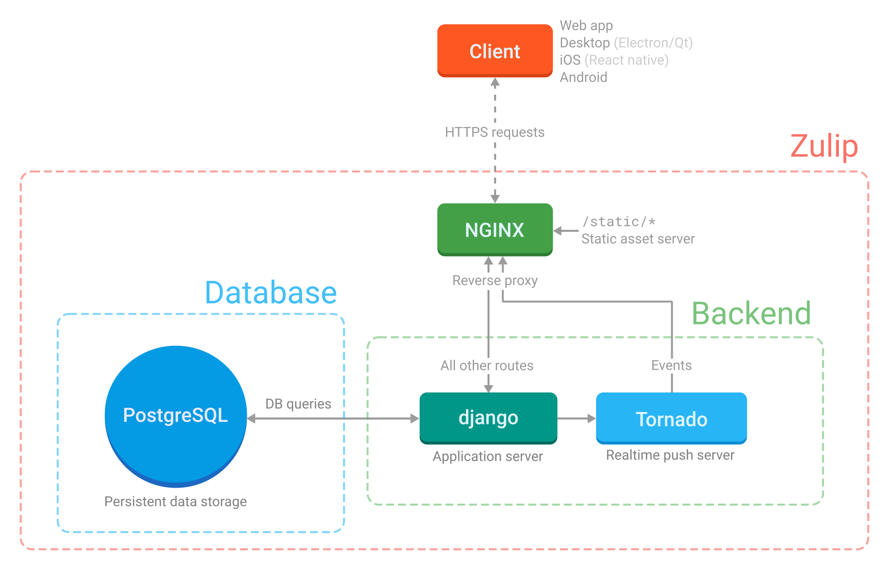

# Zulip architectural overview

## Key codebases

The main Zulip codebase is at <https://github.com/zulip/zulip>. It
contains the Zulip backend (written in Python 3.x and Django), the
web app (written in JavaScript and TypeScript) and our library of
incoming webhook [integrations](https://zulip.com/integrations/)
with other services and applications (see [the directory structure
guide](directory-structure.md)).

[Zulip Mobile](https://github.com/zulip/zulip-mobile) is the official
mobile Zulip client supporting both iOS and Android, written in
JavaScript with React Native, and [Zulip
Desktop](https://github.com/zulip/zulip-desktop) is the official Zulip
desktop client for macOS, Linux, and Windows.
[Zulip Terminal](https://github.com/zulip/zulip-terminal) is our
official terminal-based client.

We also maintain several separate repositories for integrations and
other glue code: [Python API
bindings](https://github.com/zulip/python-zulip-api); [JavaScript API
bindings](https://github.com/zulip/zulip-js); a [Hubot
adapter](https://github.com/zulip/hubot-zulip); integrations with
[Phabricator](https://github.com/zulip/phabricator-to-zulip),
[Jenkins](https://github.com/zulip/zulip-jenkins-plugin),
[Puppet](https://github.com/matthewbarr/puppet-zulip),
[Redmine](https://github.com/zulip/zulip-redmine-plugin), and
[Trello](https://github.com/zulip/trello-to-zulip);
and [many more](https://github.com/zulip/).

We use [Transifex](https://explore.transifex.com/zulip/zulip/) to do
translations.

In this overview, we'll mainly discuss the core Zulip server and web
application.

## Usage assumptions and concepts

Zulip is a real-time team chat application meant to provide a great
experience for a wide range of organizations, from companies to
volunteer projects to groups of friends, ranging in size from a small
team to tens of thousands of users. It has [hundreds of
features](https://zulip.com/features/) both large and small, and
supports dedicated apps for iOS, Android, Linux, Windows, and macOS,
all modern web browsers, several cross-protocol chat clients, and
numerous dedicated [Zulip API](https://zulip.com/api/) clients
(e.g., bots).

A server can host multiple Zulip _realms_ (organizations), each on its
own (sub)domain. While most installations host only one organization, some
host thousands, such as zulip.com. Each organization is a private
chamber with its own users, streams, customizations, and so on. This
means that one person might be a user of multiple Zulip realms. The
administrators of an organization have a great deal of control over
who can register an account, what permissions new users have, etc. For
more on security considerations and options, see [the security model
section](../production/security-model.md) and the [Zulip Help
Center](https://zulip.com/help/).

## Components



### Django and Tornado

Zulip is primarily implemented in the
[Django](https://www.djangoproject.com/) Python web framework. We
also make use of [Tornado](https://www.tornadoweb.org) for the
real-time push system.

Django is the main web application server; Tornado runs the
server-to-client real-time push system. The app servers are configured
by the Supervisor configuration (which explains how to start the server
processes; see "Supervisor" below) and the nginx configuration (which
explains which HTTP requests get sent to which app server).

Tornado is an asynchronous server and is meant specifically to hold
open tens of thousands of long-lived (long-polling)
connections -- that is to say, routes that maintain a persistent
connection from every running client. For this reason, it's
responsible for event (message) delivery, but not much else. We try to
avoid any blocking calls in Tornado because we don't want to delay
delivery to thousands of other connections (as this would make Zulip
very much not real-time). For instance, we avoid doing cache or
database queries inside the Tornado code paths, since those blocking
requests carry a very high performance penalty for a single-threaded,
asynchronous server system. (In principle, we could do non-blocking
requests to those services, but the Django-based database libraries we
use in most of our codebase don't support that, and in any case,
our architecture doesn't require Tornado to do that).

The parts that are activated relatively rarely (e.g. when people type or
click on something) are processed by the Django application server.

There is detailed documentation on the
[real-time push and event queue system](../subsystems/events-system.md); most of
the code is in `zerver/tornado`.

#### HTML templates, JavaScript, etc.

Zulip's HTML is primarily implemented using two types of HTML
templates: backend templates (powered by the [Jinja2][] template
engine used for logged-out ("portico") pages and the web app's base
content) and frontend templates (powered by [Handlebars][]) used for
live-rendering HTML from JavaScript for things like the main message
feed.

For more details on the frontend, see our documentation on
[translation](../translating/translating.md),
[templates](../subsystems/html-css.md#html-templates),
[directory structure](directory-structure.md), and
[the static asset pipeline](../subsystems/html-css.md#static-asset-pipeline).

[jinja2]: http://jinja.pocoo.org/
[handlebars]: https://handlebarsjs.com/

### nginx

nginx is the front-end web server to all Zulip traffic; it serves static
assets and proxies to Django and Tornado. It handles HTTP requests
according to the rules laid down in the many config files found in
`zulip/puppet/zulip/files/nginx/`.

`zulip/puppet/zulip/files/nginx/zulip-include-frontend/app` is the most
important of these files. It explains what happens when requests come in
from outside.

- In production, all requests to URLs beginning with `/static/` are
  served from the corresponding files in `/home/zulip/prod-static/`,
  and the production build process (`tools/build-release-tarball`)
  compiles, minifies, and installs the static assets into the
  `prod-static/` tree form. In development, files are served directly
  from `/static/` in the Git repository.
- Requests to `/json/events` and `/api/v1/events`, i.e. the
  real-time push system, are sent to the Tornado server.
- Requests to all other paths are sent to the Django app running via
  `uWSGI` via `unix:/home/zulip/deployments/uwsgi-socket`.
- By default (i.e. if `LOCAL_UPLOADS_DIR` is set), nginx will serve
  user-uploaded content like avatars, custom emoji, and uploaded
  files. However, one can configure Zulip to store these in a cloud
  storage service like Amazon S3 instead.

Note that we do not use `nginx` in the development environment, opting
for a simple Tornado-based proxy instead.

### Supervisor

We use [supervisord](http://supervisord.org/) to start server processes,
restart them automatically if they crash, and direct logging.

The config file is
`zulip/puppet/zulip/templates/supervisor/zulip.conf.template.erb`. This
is where Tornado and Django are set up, as well as a number of background
processes that process event queues. We use event queues for the kinds
of tasks that are best run in the background because they are
expensive (in terms of performance) and don't have to be synchronous
--- e.g., sending emails or updating analytics. Also see [the queuing
guide](../subsystems/queuing.md).

### memcached

memcached is used to cache database model
objects. `zerver/lib/cache.py` and `zerver/lib/cache_helpers.py`
manage putting things into memcached, and invalidating the cache when
values change. The memcached configuration is in
`puppet/zulip/files/memcached.conf`. See our
[caching guide](../subsystems/caching.md) to learn how this works in
detail.

### Redis

Redis is used for a few very short-term data stores, primarily
our rate-limiting system.

Redis is configured in `zulip/puppet/zulip/files/redis` and it's a
pretty standard configuration except for the last line, which turns off
persistence:

```text
# Zulip-specific configuration: disable saving to disk.
save ""
```

People often wonder if we could replace memcached with Redis (or
replace RabbitMQ with Redis, with some loss of functionality).

The answer is likely yes, but it wouldn't improve Zulip.
Operationally, our current setup is likely easier to develop and run
in production than a pure Redis system would be. Meanwhile, the
perceived benefit for using Redis is usually to reduce memory
consumption by running fewer services, and no such benefit would
materialize:

- Our cache uses significant memory, but that memory usage would be
  essentially the same with Redis as it is with memcached.
- All of these services have low minimum memory requirements, and in
  fact our applications for Redis and RabbitMQ do not use significant
  memory even at scale.
- We would likely need to run multiple Redis services (with different
  configurations) in order to ensure the pure LRU use case (memcached)
  doesn't push out data that we want to persist until expiry
  (Redis-based rate limiting) or until consumed (RabbitMQ-based
  queuing of deferred work).

### RabbitMQ

RabbitMQ is a queueing system. Its config files live in
`zulip/puppet/zulip/files/rabbitmq`. Initial configuration happens in
`zulip/scripts/setup/configure-rabbitmq`.

We use RabbitMQ for queuing expensive work (e.g. sending emails
triggered by a message, push notifications, some analytics, etc.) that
require reliable delivery but which we don't want to do on the main
thread. It's also used for communication between the application server
and the Tornado push system.

Two simple wrappers around `pika` (the Python RabbitMQ client) are in
`zulip/zerver/lib/queue.py`. There's an asynchronous client for use in
Tornado and a more general client for use elsewhere. Most of the
processes started by Supervisor are queue processors that continually
pull things out of a RabbitMQ queue and handle them; they are defined
in `zerver/worker/`.

Also see [the queuing guide](../subsystems/queuing.md).

### PostgreSQL

PostgreSQL is the database that stores all persistent data, that is,
data that's expected to live beyond a user's current session.
Starting with Zulip 3.0, new Zulip installations will install modern
PostgreSQL release rather than using the version included with the
operating system.

In production, PostgreSQL is installed with a default configuration. The
directory that would contain configuration files
(`puppet/zulip/files/postgresql`) has only a utility script and a custom
list of stopwords used by a PostgreSQL extension.

In a development environment, configuration of that PostgreSQL
extension is handled by `tools/postgresql-init-dev-db` (invoked by
`tools/provision`). That file also manages setting up the
development PostgreSQL user.

`tools/provision` also invokes `tools/rebuild-dev-database`
to create the actual database with its schema.

### Nagios

Nagios is an optional component used for notifications to the system
administrator, e.g., in case of outages.

`zulip/puppet/zulip/manifests/nagios.pp` installs Nagios plugins from
`puppet/zulip/files/nagios_plugins/`.

This component is intended to install Nagios plugins intended to be run
on a Nagios server; most of the Zulip Nagios plugins are intended to be
run on the Zulip servers themselves, and are included with the relevant
component of the Zulip server (e.g.
`puppet/zulip/manifests/postgresql_backups.pp` installs a few under
`/usr/lib/nagios/plugins/zulip_backups`).

## Glossary

This section gives names for some of the elements in the Zulip UI used
in Zulip development conversations. In general, our goal is to
minimize the set of terminology listed here by giving elements
self-explanatory names.

- **bankruptcy**: When a user has been off Zulip for several days and
  has hundreds of unread messages, they are prompted for whether
  they want to mark all their unread messages as read. This is
  called "declaring bankruptcy" (in reference to the concept in
  finance).

- **chevron**: A small downward-facing arrow next to a message's
  timestamp, offering contextual options, e.g., "Reply", "Mute [this
  topic]", or "Link to this conversation". To avoid visual clutter,
  the chevron only appears in the web UI upon hover.

- **ellipsis**: A small vertical three dot icon (technically called
  as ellipsis-v), present in sidebars as a menu icon.
  It offers contextual options for global filters (Combined feed
  and Starred messages), stream filters and topics in left
  sidebar and users in right sidebar. To avoid visual clutter
  ellipsis only appears in the web UI upon hover.

- **huddle**: What the codebase calls a "group direct message".

- **message editing**: If the realm admin allows it, then after a user
  posts a message, the user has a few minutes to click "Edit" and
  change the content of their message. If they do, Zulip adds a
  marker such as "EDITED" at the top of the message, visible to
  anyone who can see the message.

- **realm**: What the codebase calls an "organization" in the UI.

- **recipient bar**: A visual indication of the context of a message
  or group of messages, displaying the stream and topic or direct
  message recipient list, at the top of a group of messages. A
  typical 1-line message to a new recipient shows to the user as
  three lines of content: first the recipient bar, second the
  sender's name and avatar alongside the timestamp (and, on hover,
  the star and the chevron), and third the message content. The
  recipient bar is or contains hyperlinks to help the user narrow.

- **star**: Zulip allows a user to mark any message they can see,
  public or private, as "starred". A user can easily access messages
  they've starred through the "Starred messages" link in the
  left sidebar, or use "is:starred" as a narrow or a search
  constraint. Whether a user has or has not starred a particular
  message is private; other users and realm admins don't know
  whether a message has been starred, or by whom.

- **subject**: What the codebase calls a "topic" in many places.
