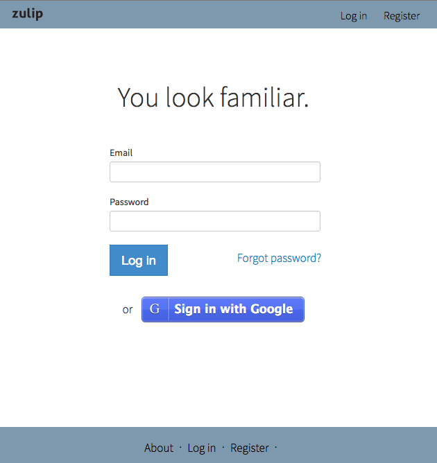
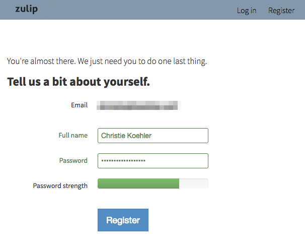

# Logging in and creating users

(As you read and follow the instructions in this section, if you run
into trouble, check out the troubleshooting advice in [the next major
section](prod-health-check-debug.html).)

Once you've finished installing Zulip, configuring your settings.py
file, and initializing the database, it's time to login to your new
installation.

## Create your user

There are two ways to create your first user account: by registering through
the Zulip web app or with the manage.py command.

### Option 1: Register through Zulip web app

Visit your Zulip instance in your web browser. You should see something like:



Click **Register** and provide your email address. You will be emailed a
confirmation link. Follow that link and you'll be prompted to complete your
registration by providing your full name and a password:



### Option 2: User manage.py command

The Zulip management console offers a number of useful commands. One of them is
the ability to create users.

You always need to run `manage.py` as the Zulip user. To start an interactive
shell as the Zulip user, use `sudo -u zulip -i`.

Use `manage.py` as follows to create your user, replacing ADMIN_DOMAIN with the
domain (realm) that you specified in `/etc/zulip/settings.py`:

```
cd deployments/current
/manage.py create_user --domain=ADMIN_DOMAIN --this-user-has-accepted-the-tos
```

You will be prompted to provide an Email and Full name. Your password will be
set to a default one, but not revealed to you. If you would like to log in to
Zulip using your email address and a password, you'll have to go through the
reset password process. Otherwise, you can login with Google or another
authentication method.

## Grant administrator access

You will likely want to make your own user account an admin user,
which you can do via the following with the `knight` management command.

You always need to run `manage.py` as the Zulip user. To start an interactive
shell as the Zulip user, use `sudo -u zulip -i`).

Be sure to replace `username@example.com` with the email address you used to
create your Zulip user:

```
./manage.py knight username@example.com -f
```

Now that you are an administrator, you will have a special
"Administration" tab linked to from the upper-right gear menu in the
Zulip app that lets you deactivate other users, manage streams, change
the Realm settings, etc.


### Creating api super users with manage.py

You can also use `./manage.py knight` with the
`--permission=api_super_user` argument to create API super users,
which are needed to mirror messages to streams from other users for
the IRC and Jabber mirroring integrations (see
`bots/irc-mirror.py` and `bots/jabber_mirror.py` for some detail on these).

## Default realm settings

The `initialize-database` script creates 1 realm that you can join, the
`ADMIN_DOMAIN` realm (defined in `/etc/zulip/settings.py`).

The `ADMIN_DOMAIN` realm is by default configured with the following settings:

* `restricted_to_domain=True`: Only people with emails ending with @ADMIN_DOMAIN can join.
* `invite_required=False`: An invitation is not required to join the realm.
* `invite_by_admin_only=False`: You don't need to be an admin user to invite other users.
* `mandatory_topics=False`: Users are not required to specify a topic when sending messages.

## Making changes to realm settings

If you would like to change the default realm settings, you can do so using the
Django management python shell (as the zulip user; `sudo -u zulip -i`):

```
cd /home/zulip/deployments/current
./manage.py shell
from zerver.models import *
r = get_realm(settings.ADMIN_DOMAIN)
r.restricted_to_domain=False # Now anyone anywhere can login
r.save() # save to the database
```

If you realize you set `ADMIN_DOMAIN` wrong, in addition to fixing the
value in settings.py, you will also want to do a similar manage.py
process to set `r.domain = "newexample.com"`.  If you've already
changed `ADMIN_DOMAIN` in settings.py, you can use
`Realm.objects.all()` in the management shell to find the list of
realms and pass the domain of the realm that is not "zulip.com" to
`get_realm`.

## Other useful manage.py commands

There are a large number of useful management commands under
`zerver/manangement/commands/`; you can also see them listed using
`./manage.py` with no arguments.

One such command worth highlighting because it's a valuable feature
with no UI in the Administration page is `./manage.py realm_filters`,
which allows you to configure certain patterns in messages to be
automatically linkified, e.g., whenever someone mentions "T1234", it
could be auto-linkified to ticket 1234 in your team's Trac instance.

## If you can't login

If you get an error, check `/var/log/zulip/errors.log` for a traceback, and
consult the next section for advice on how to debug.  If you aren't able to
figure it out, email zulip-help@googlegroups.com with the traceback and we'll
try to help you out!


Next step: [Checking that Zulip is healthy and debugging the services
it depends on](prod-health-check-debug.html).
