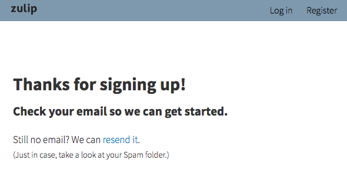

# Log in and create users

(As you read and follow the instructions in this section, if you run
into trouble, check out the troubleshooting advice in [the next major
section](prod-health-check-debug.html).)

Once you've finished installing Zulip, configuring your `settings.py`
file, and initializing the database, it's time to create your organization and
your user.

## Create your organization and user

You create your organization and user from the Zulip web app via a unique,
one-time link you create with the Zulip management console, `manage.py`:

```
cd deployments/current
./manage.py generate_realm_creation_link
```

Note: You always need to run `manage.py` as the Zulip user. To start an interactive
shell as the Zulip user, use `sudo -u zulip -i`.

Open the link generated with your web browser. You'll see the create realm
(organization) page:


Enter your email address. You should use an address that matches the domain
with which you want this realm (organization) to be associated.

Once you provide your email address, click *Create organization* and you'll be
emailed a confirmation link.



Check your email and click this link. You'll be prompted to finish setting up
your organization and your user:


Complete this form and you'll be ready to log in!

Your user will automatically have administrator access. You will have a special
"Administration" tab linked to from the upper-right gear menu in the Zulip app
that lets you deactivate other users, manage streams, change the Realm
settings, etc.


## Grant administrator access

You can make any user an administrator on the command line with the `knight`
management command:

```
./manage.py knight username@example.com -f
```

### Creating api super users with manage.py

If you need to manage IRC, Jabber, or Zephyr mirrors, you will need to create
api super users. To do this, use `./manage.py knight` with the
`--permission=api_super_user` argument

(See `bots/irc-mirror.py` and `bots/jabber_mirror.py` for further detail on
these).

## Making changes to realm settings

If you would like to change the default realm settings, you can do so using the
Django management python shell (as the zulip user; `sudo -u zulip -i`):

```
cd /home/zulip/deployments/current
./manage.py shell
from zerver.models import *
r = get_realm("REALM_DOMAIN")
r.restricted_to_domain=False # Now anyone anywhere can login
r.save() # save to the database
```

You can use `Realm.objects.all()` in the management shell to find the list of
realms and pass the domain of the realm that is not "zulip.com" to `get_realm`.

## Other useful manage.py commands

There are a large number of useful management commands under
`zerver/manangement/commands/`; you can also see them listed using
`./manage.py` with no arguments.

One such command worth highlighting because it's a valuable feature
with no UI in the Administration page is `./manage.py realm_filters`,
which allows you to configure certain patterns in messages to be
automatically linkified, e.g., whenever someone mentions "T1234", it
could be auto-linkified to ticket 1234 in your team's Trac instance.

## If you can't login

If you get an error, check `/var/log/zulip/errors.log` for a traceback, and
consult the next section for advice on how to debug.  If you aren't able to
figure it out, email zulip-help@googlegroups.com with the traceback and we'll
try to help you out!


Next step: [Checking that Zulip is healthy and debugging the services
it depends on](prod-health-check-debug.html).
