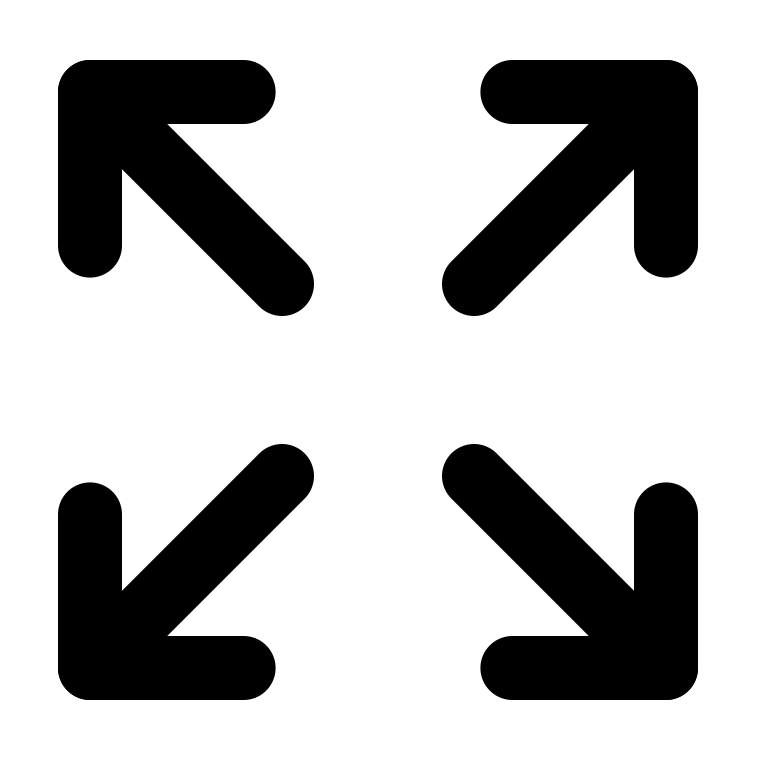
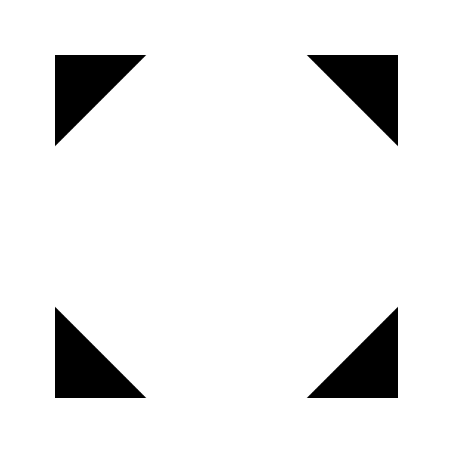
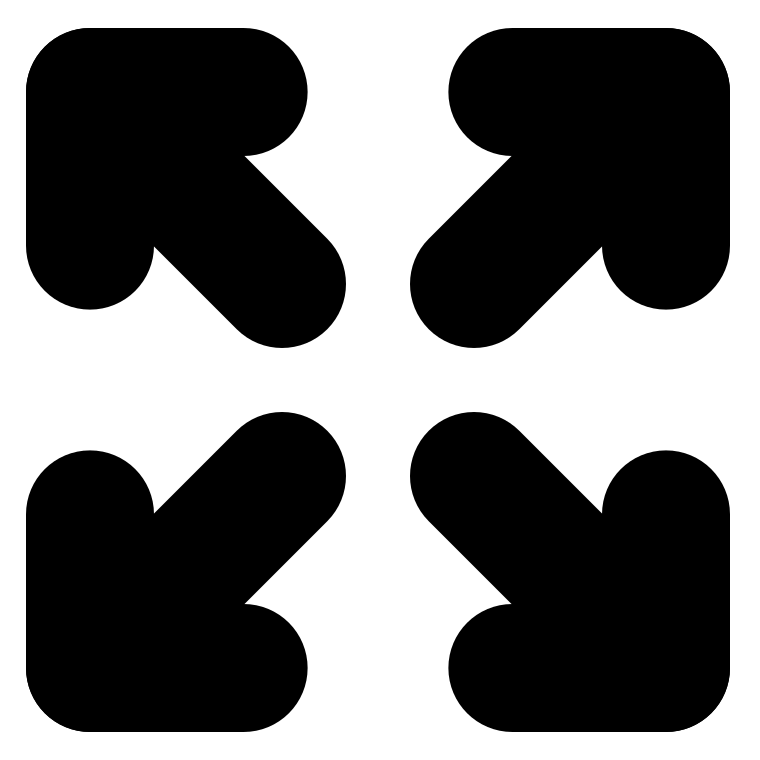
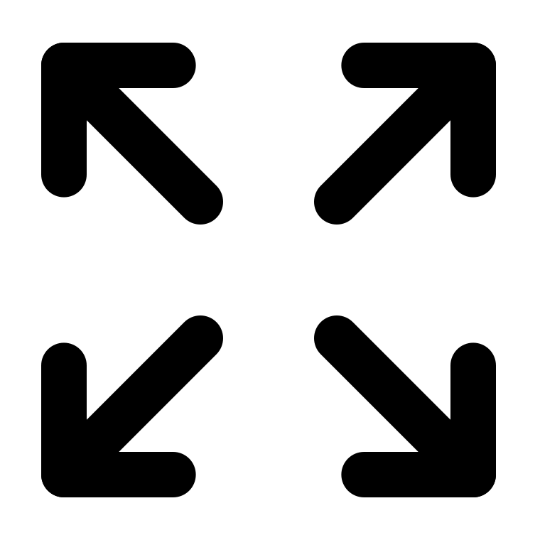
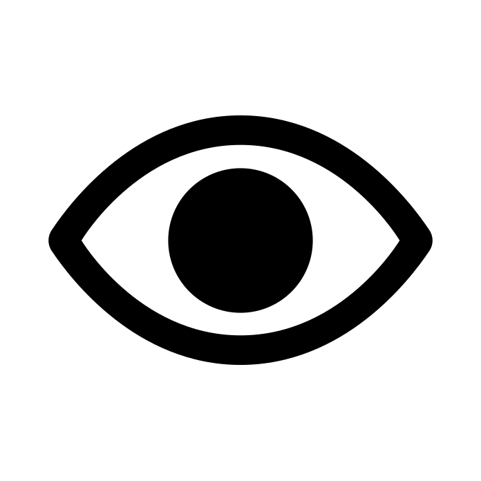
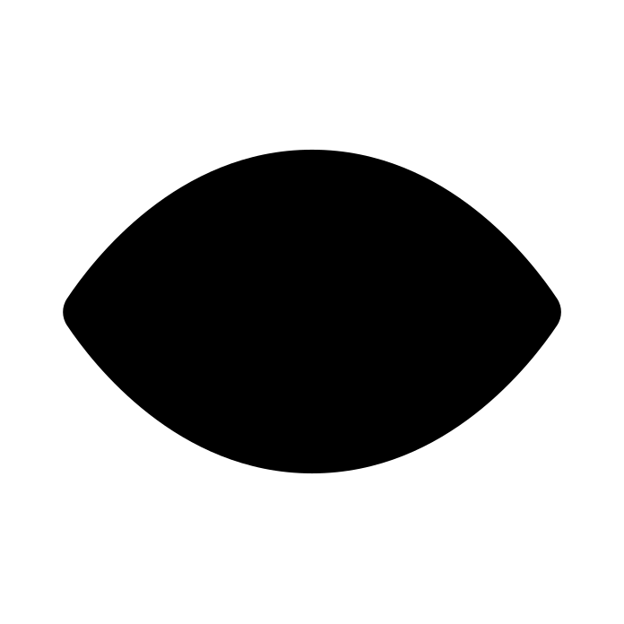

# Icons

Zulip makes extensive use of icons to decorate elements in the UI as
well as for compact buttons and other small interactive elements.

## Using icons

- Modern Zulip icons are implemented using a class-based combination
  like `<i class="zulip-icon zulip-icon-smile"></i>`, which is rendered
  using generated CSS that maps that class name (`zulip-icon-smile`)
  to the SVG file located at `web/shared/icons/smile.svg`.

- Older icons use [Font Awesome 4.7](https://fontawesome.com/),
  declared in our HTML via `<i class="fa fa-paperclip"></i>`. We are
  migrating away from Font Awesome both for design and licensing
  reasons (Font Awesome 5.0+ is no longer fully open source).

Always consider [accessibility](../subsystems/accessibility.md) when
using icons. Typically, this means:

- Icons that are used **purely as a decoration** immediately adjacent a
  textual label (for example, in our popover menus) should use `aria-hidden`,
  so that screenreaders ignore them in favor of reading the label.

- Buttons whose **entire label** is an icon should have a
  [tooltip](../subsystems/html-css.md#tooltips) as well as an
  `aria-label` declaration, so that screenreaders will explain the
  button. Generally, the tooltip text should be identical to the
  `aria-label` text.

## Adding a new icon

A new feature, such as a new menu option, may require a new icon to represent
it. The issue you're working on may not have an icon specified upfront. In that
case, you should:

1. Prototype using a [Lucide icon](https://lucide.dev/icons/), which is the
   preferred source for icons in Zulip. New SVG files must be placed in the
   `web/shared/icons/` directory to be used (don't forget to `git add` new
   icons along with your other changes).

1. **When your feature is nearing completion**, post in the [appropriate
   channel](https://zulip.com/development-community/#where-do-i-send-my-message)
   in the Zulip development community to discuss what icon should be used (e.g.,
   #design for web app icons). You can use the discussion thread linked from the
   issue you're working on if there is one.

1. Once there is general consensus on the icon to be used, be sure to
   [prepare the icon's SVG file](#preparing-icons-for-use-with-zulip)
   so that it displays correctly in Zulip.

1. Follow the [attribution guidelines](../contributing/licensing.md)
   to document the icon's source in `docs/THIRDPARTY/`.

## Preparing icons for use with Zulip

You may discover that your chosen icon looks terribly broken when displayed
in Zulip. There are two common issues with SVG files that must be manually
corrected:

1. [Icons that rely on strokes](#correcting-icons-that-include-strokes),
   rather than paths
2. [Icons that have an `evenodd` value](#correcting-icons-with-an-evenodd-fill-rule)
   on the `fill-rule` attribute

Each of those problems requires a different fix, followed by some
[cleanup of the resulting SVG file](#cleaning-up-the-svg-code).

### Correcting icons that include strokes

For example, the unaltered [Lucide expand icon](https://lucide.dev/icons/expand)
illustrates what we'd expect to see versus what we actually see after the icon
goes through Zulip's automated SVG-to-font conversion:

| Expected icon (SVG)                                                               | Broken appearance (SVG to font)                                                      |
| --------------------------------------------------------------------------------- | ------------------------------------------------------------------------------------ |
|  |  |

What happened there is that the icon uses strokes, which do not properly convert
to font outlines in Zulip's automated conversion system.

To properly prepare an SVG icon for use with Zulip, you need to make sure that
all stroke components are converted to paths:

1. Open the SVG file in [Inkscape](https://inkscape.org/), a free and open-source
   visual editor for vector images, including SVG.

1. Use `Ctrl + A` or otherwise select all components of the icon.

1. Locate Inkscape's Path menu, and choose the Stroke to Path item. You'll
   immediately see your icon appear to balloon up: this is expected, because
   the previous stroke in use has now been applied to your icon's converted paths.

1. Examine the Stroke style applied to your paths on the Fill and Stroke tab of
   Inkscape's object panel. Be sure to reduce the Stroke to 0:

| Stroke incorrectly still applied                                             | Stroke set to zero                                                                       |
| ---------------------------------------------------------------------------- | ---------------------------------------------------------------------------------------- |
|  |  |

At this point, you can save your file in the `web/shared/icons/` directory and
close Inkscape before [cleaning up the SVG file](#cleaning-up-the-svg-code).

### Correcting icons with an `evenodd` fill rule

Certain icons may include a `fill-rule="evenodd"` attribute-value pairing. Those are
often found on icons where one path appears inside of another. That is the case with
the custom eye icon here, which turns solid black after going through Zulip's automated
SVG-to-font conversion:

| Expected icon (SVG)                                                              | Broken appearance (SVG to font)                                                    |
| -------------------------------------------------------------------------------- | ---------------------------------------------------------------------------------- |
|  |  |

Should you encounter an icon that includes a `fill-rule` (easily spotted in the SVG file's
code), you'll need to bring it into Inkscape to rework its paths.

1. Open the SVG file in [Inkscape](https://inkscape.org/), a free and open-source
   visual editor for vector images, including SVG.

1. Use `Ctrl + A` or otherwise select all components of the icon.

1. Locate Inkscape's Path menu, and choose Object to Path. This converts circles
   and other SVG shapes to paths.

1. Use `Ctrl + A` again to make sure all paths are still selected. From the Path menu,
   choose Flatten. This typically makes a reasonable combination of the visible areas
   of multiple paths.

1. Finally, again with `Ctrl + A` to ensure the flattened paths are selected, return to
   the Path menu and choose Combine. That joins all paths into a single, complex path.

At this point, you can save your file in the `web/shared/icons/` directory and
close Inkscape before [cleaning up the SVG file](#cleaning-up-the-svg-code).

### Cleaning up the SVG code

While Inkscape does a fine job with altering SVG files for proper SVG-to-font
conversion, it also leaves a lot of crufty markup behind. So next, open your
icon's SVG file in your editor of choice.

Once opened in your editor, the file's Inkscape source will look something like this
(the example here shows only the first 25 lines or so):

```xml
<?xml version="1.0" encoding="UTF-8" standalone="no"?>
<svg
   width="24"
   height="24"
   viewBox="0 0 24 24"
   fill="none"
   stroke="currentColor"
   stroke-width="2"
   stroke-linecap="round"
   stroke-linejoin="round"
   class="lucide lucide-expand-icon lucide-expand"
   version="1.1"
   id="svg8"
   sodipodi:docname="expand.svg"
   inkscape:version="1.4 (e7c3feb1, 2024-10-09)"
   xmlns:inkscape="http://www.inkscape.org/namespaces/inkscape"
   xmlns:sodipodi="http://sodipodi.sourceforge.net/DTD/sodipodi-0.dtd"
   xmlns="http://www.w3.org/2000/svg"
   xmlns:svg="http://www.w3.org/2000/svg">
  <defs
     id="defs8" />
  <sodipodi:namedview
     id="namedview8"
     pagecolor="#ffffff" />

<!-- ...and so on. -->
```

Your last task is to clean up the SVG's XML so that only its essential components
remain:

1. Consider using Git to add and temporarily commit the icon as output by Inkscape.
   If you make a mistake while cleaning up the icon, you can use `git restore` to
   return to that point.

1. Strip back the opening of the file to include only the `<svg>` tag and its `xmlns`,
   `width`, `height`, and `viewBox` attributes and their values as set by
   Inkscape. (There is no need to preserve the `fill` attribute, as it defaults to
   black for its [initial value](https://www.w3.org/TR/SVG2/painting.html#SpecifyingFillPaint).)

1. Remove all other tags in the file except for the `<path>` tags, which should be
   cleaned up until they have only a `d` attribute and its value as output by Inkscape.

1. When you are finished, your SVG file's source code should look something like this:

```xml
<svg width="24" height="24" viewBox="0 0 24 24" xmlns="http://www.w3.org/2000/svg">
  <path d="m 15,14 a 1,1 0 0 0 -0.707031,0.292969 1,1 0 0 0 0,1.414062 l 6,6 a 1,1 0 0 0 1.414062,0 1,1 0 0 0 0,-1.414062 l -6,-6 A 1,1 0 0 0 15,14 Z"/>
  <path d="m 20.292969,2.2929688 -6,6 a 1,1 0 0 0 0,1.4140625 1,1 0 0 0 1.414062,0 l 6,-6 a 1,1 0 0 0 0,-1.4140625 1,1 0 0 0 -1.414062,0 z"/>
  <path d="m 21,15.199219 a 1,1 0 0 0 -1,1 V 20 h -3.800781 a 1,1 0 0 0 -1,1 1,1 0 0 0 1,1 H 21 a 1.0001,1.0001 0 0 0 1,-1 v -4.800781 a 1,1 0 0 0 -1,-1 z"/>
  <path d="m 16.199219,2 a 1,1 0 0 0 -1,1 1,1 0 0 0 1,1 H 20 v 3.8007812 a 1,1 0 0 0 1,1.0000001 1,1 0 0 0 1,-1.0000001 V 3 A 1.0001,1.0001 0 0 0 21,2 Z"/>
  <path d="m 3,15.199219 a 1,1 0 0 0 -1,1 V 21 a 1.0001,1.0001 0 0 0 1,1 H 7.8007812 A 1,1 0 0 0 8.8007813,21 1,1 0 0 0 7.8007812,20 H 4 v -3.800781 a 1,1 0 0 0 -1,-1 z"/>
  <path d="m 9,14 a 1,1 0 0 0 -0.7070312,0.292969 l -6,6 a 1,1 0 0 0 0,1.414062 1,1 0 0 0 1.4140625,0 l 6,-6 a 1,1 0 0 0 0,-1.414062 A 1,1 0 0 0 9,14 Z"/>
  <path d="M 3,2 A 1.0001,1.0001 0 0 0 2,3 V 7.8007812 A 1,1 0 0 0 3,8.8007813 1,1 0 0 0 4,7.8007812 V 4 H 7.8007812 A 1,1 0 0 0 8.8007813,3 1,1 0 0 0 7.8007812,2 Z"/>
  <path d="m 3,2 a 1,1 0 0 0 -0.7070312,0.2929688 1,1 0 0 0 0,1.4140625 l 6,6 a 1,1 0 0 0 1.4140625,0 1,1 0 0 0 0,-1.4140625 l -6,-6 A 1,1 0 0 0 3,2 Z"/>
</svg>
```

With the source code tided up, take a moment to preview your cleaned-up file in your
browser or operating system. If you're satisfied with how it looks, you can run
`git add` and `git commit --amend` to commit your cleaned up icon--overwriting the
output from Inkscape that you committed above.

Your commit should also follow the [attribution guidelines](../contributing/licensing.md)
and document the icon's original source in `docs/THIRDPARTY/`.

## Updating UI icons in the help center

When changing an icon for an existing feature, be sure to [update the help
center](../documentation/helpcenter.md#icons) accordingly (`git grep` is your
friend for finding instances of icons to be replaced).
