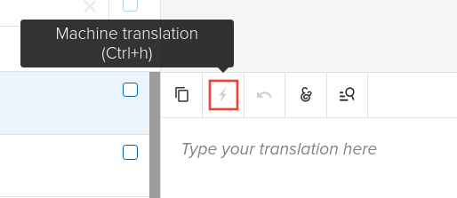

# Translation guidelines

Zulip's has full support for Unicode (and partial support for RTL
languages), so you can use your preferred language everywhere in
Zulip.

Additionally, the Zulip UI is translated into more than a dozen major
languages, including Spanish, German, Hindi, French, Chinese, Russian,
and Japanese, and we're always excited to add more. If you speak a
language other than English, your help with translating Zulip would be
greatly appreciated!

If you are interested in knowing about the technical end-to-end
tooling and processes for tagging strings for translation and syncing
translations in Zulip, read about [Internationalization for
Developers](internationalization.md).

## Translators' workflow

These are the steps you should follow if you want to help translate
Zulip:

1. Join [#translation][translation-stream] in the [Zulip development
   community server](https://zulip.com/development-community/), and say hello.
   That stream is also the right place for any questions, updates on your
   progress, reporting problematic strings, etc.

1. Sign up for [Transifex](https://www.transifex.com) and ask to join the [Zulip
   project on Transifex](https://explore.transifex.com/zulip/zulip/), requesting access
   to any languages that you'd like to contribute to (or add new ones).

   :::{note}
   Unless you plan to contribute country-specific translations, do not
   select a country-specific language in the **Languages** menu when you sign
   up. E.g. use **English (United Kingdom)** if you plan to translate Zulip
   into UK English, but select **Russian** rather than **Russian (Russia)** for
   general Russian translations.
   :::

1. Wait for a maintainer to approve your Transifex access; this
   usually takes less than a day. You should then be able to access
   Zulip's dashboard in Transifex.

1. Translate the strings for your language in Transifex. Zulip has
   several resource files:

   - `mobile.json` is for the iOS/Android mobile apps.
   - `desktop.json` is for the parts of the Zulip desktop apps that
     are not shared with the Zulip web app.
   - `django.po` and `translations.json` have strings for the next
     major release of the Zulip server and web app (which is what we
     run on chat.zulip.org and Zulip Cloud).
   - The variants of `django.po` and `translations.json` with names
     starting with a version, like `5-x--`, are strings for Zulip's
     current [stable release series](../overview/release-lifecycle.md).

   Transifex is smart about only asking you to translate a string once
   even if it appears in multiple resources. The `5-x--` type variants
   allow translators to get a language to 100% translated for the
   current release.

1. If possible, test your translations (details below).

1. Ask in Zulip for a maintainer to sync the strings from Transifex,
   merge them to `main`, and deploy the update to chat.zulip.org so
   you can verify them in action there.

Some useful tips for your translating journey:

- Follow your language's [translation guide](#translation-style-guides).
  Keeping it open in a tab while translating is very handy. If one
  doesn't exist one, write one as you go; they're easiest to write as
  you go along and will help any future translators a lot.

- Don't translate variables or code (usually preceded by a `%`, inside
  HTML tags `<...>`, or enclosed in braces like `{variable}`); just
  keep them verbatim.

- When context is unclear, you may find [GitHub
  search](https://github.com/search?q=org%3Azulip+%22alert+word+already+exists%22&type=code)
  helpful for finding the code using a given string (ignore `.po` and
  `.json` matches, and note the search box is semi-invisible in the
  upper-left corner of the page), or looking at the "Occurrences"
  section in the Transifex UI, browsing to the file on
  [GitHub](https://github.com/zulip/zulip/), and then searching for
  the string with `Ctrl+F` in your browser.

- When in doubt, ask for context in
  [#translation](https://chat.zulip.org/#narrow/stream/58-translation) in
  the [Zulip development community server](https://zulip.com/development-community/).

- If there are multiple possible translations for a term, search for it in
  the _Concordance_ tool (the button with a magnet in the top right corner).

  It will show if anyone translated that term before, so we can achieve good
  consistency with all the translations, no matter who makes them.

- Pay attention to capital letters and punctuation. Details make the
  difference!

- Take advantage of the hotkeys the Transifex Web Editor provides, such as
  `Tab` for saving and going to the next string.

- While one should definitely prioritize translating
  `translations.json`, since the most prominent user-facing strings
  are there, API error messages in `django.po` are presented to users,
  so a full translation should include them.

### Testing translations

This section assumes you have a
[Zulip development environment](../development/overview.md) set up;
if setting one up is a problem for you, ask in chat.zulip.org and we
can usually just deploy the latest translations there.

- First, download the updated resource files from Transifex using the
  `tools/i18n/sync-translations` command (it will require some [initial
  setup](internationalization.md#transifex-cli-setup)). This
  command will download the resource files from Transifex and replace
  your local resource files with them, and then compile them. You can
  now test your translation work in the Zulip UI.

There are a few ways to see your translations in the Zulip UI:

- You can insert the language code as a URL prefix. For example, you
  can view the login page in German using
  `http://localhost:9991/de/login/`. This works for any part of the
  Zulip UI, including portico (logged-out) pages.
- For Zulip's logged-in UI (i.e. the actual web app), you can [pick the
  language](https://zulip.com/help/change-your-language) in the
  Zulip UI.
- If your system has languages configured in your OS/browser, Zulip's
  portico (logged-out) pages will automatically use your configured
  language. Note that we only tag for translation strings in pages
  that individual users need to use (e.g. `/login/`, `/register/`,
  etc.), not marketing pages like `/features/`.
- In case you need to understand how the above interact, Zulip figures
  out the language the user requests in a browser using the following
  prioritization (mostly copied from the Django docs):

  1. It looks for the language code as a URL prefix (e.g. `/de/login/`).
  1. It looks for the cookie named 'django_language'. You can set a
     different name through the `LANGUAGE_COOKIE_NAME` setting.
  1. It looks for the `Accept-Language` HTTP header in the HTTP request
     (this is how browsers tell Zulip about the OS/browser language).

- Using an HTTP client library like `requests`, `cURL` or `urllib`,
  you can pass the `Accept-Language` header; here is some sample code to
  test `Accept-Language` header using Python and `requests`:

  ```python
  import requests
  headers = {"Accept-Language": "de"}
  response = requests.get("http://localhost:9991/login/", headers=headers)
  print(response.content)
  ```

  This can occasionally be useful for debugging.

### Machine translation

Transifex has [built-in machine translation
capabilities](https://help.transifex.com/en/articles/6271130-setting-up-machine-translation).
If machine translation is enabled for your language, you can generate one by
clicking the **lightning** symbol above the translation box.



There are a few things to keep in mind if you choose to make use of machine
translation:

- We expect human-quality translations for Zulip. While machine translation can
  be a helpful aid, please be sure to review all machine translated strings.

- We are using machine translation in HTML mode, which has a known bug that
  causes special characters to be rendered as their HTML encodings. For example,
  a `'` will be converted to ` &#39;`. Please be sure to fix this when reviewing
  translations.

### Translation style guides

We maintain translation style guides for Zulip, giving guidance on how
Zulip should be translated into specific languages (e.g. what word to
translate words like "stream" to), with reasoning, so that future
translators can understand and preserve those decisions:

- [Chinese](chinese.md)
- [Finnish](finnish.md)
- [French](french.md)
- [German](german.md)
- [Hindi](hindi.md)
- [Japanese](japanese.md)
- [Polish](polish.md)
- [Russian](russian.md)
- [Spanish](spanish.md)

Some translated languages don't have these, but we highly encourage
translators for new languages (or those updating a language) write a
style guide as they work, since it's easy to take notes as you
translate, and doing so greatly increases the ability of future
translators to update the translations in a consistent way. See [our
docs on this documentation](../documentation/overview.md) for how to
submit your changes.

### Capitalization

We expect that all the English translatable strings in Zulip are
properly capitalized in a way consistent with how Zulip does
capitalization in general. This means that:

- The first letter of a sentence or phrase should be capitalized.
  - Correct: "Manage streams"
  - Incorrect: "Manage Streams"
- All proper nouns should be capitalized.
  - Correct: "This is Zulip"
  - Incorrect: "This is zulip"
- All common words like URL, HTTP, etc. should be written in their
  standard forms.
  - Correct: "URL"
  - Incorrect: "Url"

The Zulip test suite enforces these capitalization guidelines in the
web app codebase [in our test
suite](../testing/testing.md#other-test-suites)
(`./tools/check-capitalization`; `tools/lib/capitalization.py` has
some exclude lists, e.g. `IGNORED_PHRASES`).

[translation-stream]: https://chat.zulip.org/#narrow/stream/58-translation
