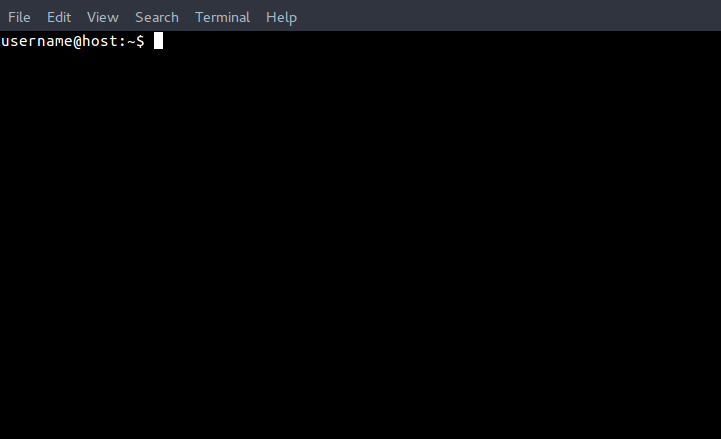

# Shell tips

The *shell* is a **command line interpreter**. To use it you can open a
*terminal* (sometimes called a *console*). This is how most terminal windows
look like:



If you haven't used it before, you should probably take a look at
[this tutorial](http://linuxcommand.org/lc3_learning_the_shell.php).

If you're using Windows,
[these videos](https://www.youtube.com/playlist?list=PL6gx4Cwl9DGDV6SnbINlVUd0o2xT4JbMu)
may be useful too, but keep in mind that the following tips only apply to
Linux/macOS environments (Unix shells). You can also use a tool, for example
[Cygwin](https://www.cygwin.com/), to have a Unix-like shell on Windows.

## The prompt (`$`)

When searching Google, or Zulip's docs, you'll find commands that begin
with a dollar sign `$` or a dollar sign preceded by some text
(e.g. `(venv)john@laptop:~$`).

This is called the **prompt**, and it's only an indicator that the shell is
awaiting new orders. The prompt can contain useful information, let's look
at `(venv)john@laptop:~$`:

- `(venv)` informs the user that they're currently in a virtual environment
(more on [Python virtual
  environments](http://docs.python-guide.org/en/latest/dev/virtualenvs/))
- the `john` before `@` is the username
- the `laptop` is the host machine name
- the `~` after the colon informs the user they're currently in the home
folder of the user `john`

You shouldn't type the prompt or the text preceding it, since it isn't a
part of the commands.

## Tilde character (`~`)

It's very frequent to see the tilde (`~`) in paths. The tilde is an
abbreviation for your home directory (`/home/YOUR_USERNAME` most of the times).

That's why the following is exactly the same, if the user running it is
`john`:

```
$ cd ~
$ cd /home/john
```

## Change directory (`cd`)

When you're using the shell, you work inside a directory (the one specified in
the prompt). This way you can point to files relative to your current
directory, instead of writing the whole path.

Imagine you have a file called `ideas.txt` inside `/home/john/notes/`, and
you want to edit it using `nano`. You could use:

```
$ nano /home/john/notes/ideas.txt
```

However, that isn't very practical, especially if you are working with
longer paths.

That's why it's very useful to change the path where you are currently
located (usually known as **working directory**). To do that, you use `cd`
(**c**hange **d**irectory):

```
$ cd /home/john/notes/
~/notes$ nano ideas.txt
```

Or, if you're the user `john`: `cd ~/notes`.

You can now access to all the files inside `/home/john/notes` directly, without
needing to type the whole path.

Relative paths make it much easier to move through files and
directories, too.

## Running commands as root (`sudo`)

You may have noticed that many commands begin with `sudo`. This informs the
shell that the following command must be run as the root - a user that by
default has access to all commands and files on a Unix operating system (i.e.
a user with administrator privileges). That's why you may be asked for a
password in those cases: the system verifies you have permission to act as
the *root* user.

In case you were wondering, the name `sudo` comes from **s**uper **u**ser
**do**.

## Escaping characters

Some characters cannot be used directly in the shell, because they have a
special meaning. Consider the following example:

```
$ echo "He said hello"
He said hello
```

What if you wanted to display double quotes? You can't use
`echo "He said "hello""`, because in that case you're using the
double quotes for two different purposes:

- Delimiting the string you want to use, from `He` to `"hello"`.
- Quoting something, by literally printing `"`.

You have to specify which double quotes are used in each case. When you want
one of those "special characters" to be literally printed, that's called
**character escaping**. To escape a character, simply add a backslash (`\`)
before it.

Returning to our example:

```
$ echo "He said \"hello\""
He said "hello"
```

As you can see, the double quotes with the backslash are shown, but the ones
without it are used as string delimiters.

Double quotes aren't the only case of special characters. Some others are `$`,
`#`, `{` or `}`, but there are many more. The backslash itself can be escaped
as well, using the same procedure: `\\`.

## Sequencing commands

It's also possible to run multiple commands in a single line. For that purpose,
the shell provides two different separators:

- **Semicolon `;`**: runs a command, and once it has finished, runs the next
  one:

  ```
  $ echo "Hello"; echo "World!"
  Hello
  World!
  ```

- **Double ampersand `&&`**: runs a command, and **only if** it finished
  without errors, it proceeds with the next one:

  ```
  $ qwfvijwe && echo "Hello"
  qwfvijwe: command not found
  ```

  Notice that it doesn't print `Hello` at the end, because the previous
  command (`qwfvijwe`) returned an error.

  When using an incorrect command with a semicolon, the `Hello` will still
  be printed:

  ```
  $ qwfvijwe; echo "Hello"
  qwfvijwe: command not found
  Hello
  ```

## Splitting commands into multiple lines

Sometimes you end up with a very long command, that is hard to read and may
be unclear. This is a problem, especially if you want to share that command,
e.g. in a documentation file.

In those cases, you can use a backslash at the end of each line, to inform the
shell "wait, there's more on the next line".

This is an example, taken from the docs on how to install the Zulip development
environment:

```
sudo apt-get -y purge vagrant && \
wget https://releases.hashicorp.com/vagrant/2.0.2/vagrant_2.0.2_x86_64.deb && \
sudo dpkg -i vagrant*.deb && \
sudo apt-get -y install build-essential git ruby lxc lxc-templates cgroup-lite redir && \
vagrant plugin install vagrant-lxc && \
vagrant lxc sudoers
```

It's all a single command, joined using the double ampersand explained in
[Sequencing commands](#sequencing-commands). If you're typing it manually,
you don't need to include the backslashes, just write it all on the same line,
and hit <kbd>ENTER</kbd>/<kbd>RETURN</kbd> at the end.

If you think about it, what is happening here is actually another case of
character escaping. The newline character (the one that appears when you hit
<kbd>ENTER</kbd>) usually means "read this command". However, here we want to
literally have the newline character, and thus the `\<newline>`.

The newline character is invisible (we only see a line break), but it's still
there!

## Arguments

Most commands need additional data to work, like a path or a file. That extra
information is called an **argument**, and it's specified after the name of the
command, like this:

```
$ cd /home/john/notes
```

Here, the command is `cd`, and the first (and only) argument is
`/home/john/notes`:

- `cd` - *command*: changes your current directory.

- `/home/john/notes` - *argument*: the directory where you want to go.

In each command the arguments are specified in different ways, and have
different meanings.

Sometimes, a command can accept arguments indicated with dashes. Here's another
example of arguments usage:

```
$ nano -C /home/john/backups --mouse todo.txt
```

As you can see, some arguments imply that more information has to be specified,
while others don't.

In this case, we're saying: "Bash, use the app `nano` to open the file
`todo.txt`, enabling mouse support, and saving the backup files to
`/home/john/backups`". The different parts are:

- `nano` - *command*: program that allows editing text easily.

- `-C` - *argument*: needs you to indicate where the backups should be stored,
  and thus you have to add an additional argument after it, to specify the
  directory (`/home/john/backups` in the example).

- `--mouse` - *argument*: is just an option you set, `nano` doesn't need
  anything else to make it work. Thus, there isn't any extra argument for that.

Note that the `todo.txt` is the file we want to open! It has nothing to do with
the previous argument. This will probably clarify it (taken from `nano`'s
help):

```
Usage: nano [OPTIONS] [FILE]...
```

So, in the options you indicate the arguments, and `FILE` is... well, the file.

Don't worry, you don't have to memorize the meaning of
all the arguments for every single command. There are
[tools](#understanding-commands) that help you with that :wink:.

## Shebang

You can run some files directly, without specifying a program to interpret
them.

That's why you may have seen cases, in the Zulip codebase or
elsewhere, when some Python scripts are called with `python`:

```
$ python my_program.py
```

While other times, `python` isn't used:

```
$ ./my_program.py
```

In the latter case, the operating system will look at the beginning of
the script to identify what interpreter (like `python` in this
example) to run it with.

The note telling the OS how to interpret the file goes on the file's
very first line, and it's called a **shebang**. In our Python scripts,
it looks like this:

```
#!/usr/bin/env python3
```

With this, you're telling the operating system: "if I tell you to run
this, ask `/usr/bin/env python3` how to understand it".

The result is that the operating system is asked to run the script, it
runs the command specified in the shebang, with the script filename
added as a command-line argument. So, returning to our example with
`my_program.py`, when you run `./my_program.py`, what happens under
the hood is equivalent to:

```
$ /usr/bin/env python3 ./my_program.py
```

The purpose of `/usr/bin/env` in our shebangs is as a way to locate
the `python3` program in your current environment, the same one the
shell would use if you ran `python3 my_program.py`.  You may see
Python scripts outside of Zulip with a shebang like
`#!/usr/bin/python3`; but because of the way Python virtualenvs work,
this has the effect of running the script outside of any currently
activated virtualenv.  We use `/usr/bin/env` to keep our scripts
running inside the virtualenv where we've installed all our
dependencies.

Another example of a shebang is the one used in Bash scripts. In those
cases, `#!/bin/bash` or `#!/bin/sh` is used.

## Understanding commands

Frequently, you may find commands that you don't understand, or don't
know what they do. You can use `man <command>` to see the **man**ual page for
that specific command. Also, you may find useful
[explainshell](http://explainshell.com/), a webpage that explains what most
commands do, part by part.
Finally, [docopt](http://docopt.org/) can help you understand the syntax used
by command-line tools to describe their interface, and make sense of strings like
`cd: usage: cd [-L|[-P [-e]] [-@]] [dir]`).

## Cheatsheet

There are many more commands in the shell, besides the ones explained in this
file.
[Here](https://www.git-tower.com/blog/command-line-cheat-sheet/) you can find
a simple yet useful cheatsheet, created by Tower, that could help you
understand and remember what other common commands do (e.g. `ls`).

## Git

Probably at this point you've heard about Git. It's basically a tool that most
developers use to manage all the changes in their code.

At first it seems like magic, but once you get the basic concepts you find it
extremely useful and even easy to use (at least the 99% of the time).

To learn more about how to use it, read
[our docs](../git/index.html) on Git and
Github.

[This cheatsheet][git-cheat-detailed]
will be useful in your journey, as well.


[git-cheat-detailed]: ../git/cheat-sheet.html#detailed-cheat-sheet
