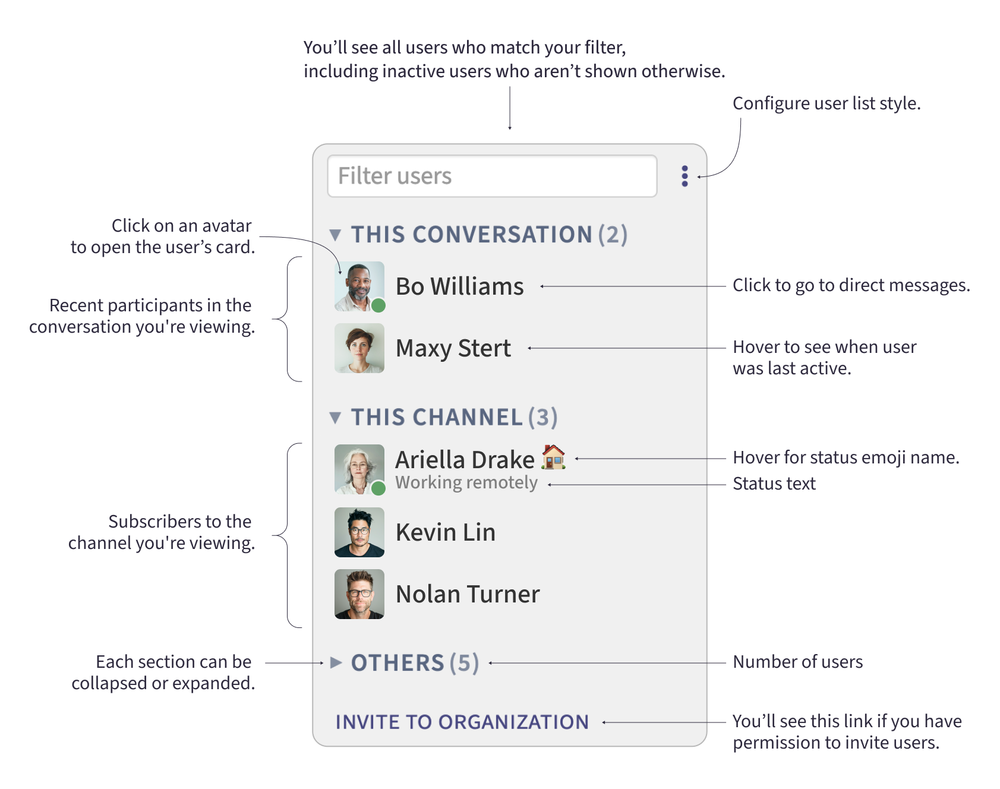

import {Steps, TabItem, Tabs} from "@astrojs/starlight/components";

import FlattenedSteps from "../../components/FlattenedSteps.astro";
import KeyboardTip from "../../components/KeyboardTip.astro";
import NavigationSteps from "../../components/NavigationSteps.astro";

import MoreVerticalIcon from "~icons/zulip-icon/more-vertical";
import UserListIcon from "~icons/zulip-icon/user-list";

In the Zulip web and desktop app, the right sidebar shows a list of users in
your organization. The user list has up to three section:

* **This conversation**: Recent participants in the conversation you're viewing.
* **This channel**: Subscribers to the channel you're viewing.
* **Others**: Everyone else.

In organizations with up to 600 users, everyone is shown. In larger
organizations, only users who have been active in the last two weeks are shown,
but everyone is included when you [search](#filter-users).
[Deactivated users](/help/deactivate-or-reactivate-a-user) and
[bots](/help/bots-overview) are not listed.

You can choose to have each user's name appear with their
[avatar](/help/change-your-profile-picture), or select a one of the more compact
user list styles. To avoid distraction, you can
[hide](#show-or-hide-the-user-list) the user list any time.

Here is an overview of all the information and actions you can take in Zulip's
user list.

## Filter users

<Tabs>
  <TabItem label="Desktop/Web">
    <Steps>
      1. If the user list is hidden, click the **user list** (<UserListIcon />) icon in the upper right to show it.
      1. Type the name of the user you are looking for in the **Filter users** box at
         the top of the right sidebar.
    </Steps>

    <KeyboardTip>
      You can also use the <kbd>W</kbd> keyboard shortcut to start searching for
      a person.
    </KeyboardTip>
  </TabItem>
</Tabs>

## Configure user list style

<Tabs>
  <TabItem label="Via right sidebar">
    <Steps>
      1. If the user list is hidden, click the **user list** (<UserListIcon />) icon in the upper right to show it.
      1. Click the **ellipsis** (<MoreVerticalIcon />)
         to the right of the **Filter users** box.
      1. Toggle your preferred option for **User list style**.
    </Steps>
  </TabItem>

  <TabItem label="Via personal settings">
    <FlattenedSteps>
      <NavigationSteps target="settings/preferences" />

      1. Under **Information**, toggle your preferred option for **User list style**.
    </FlattenedSteps>
  </TabItem>
</Tabs>

## Show or hide the user list

<Tabs>
  <TabItem label="Desktop/Web">
    <Steps>
      1. Click the **user list** (<UserListIcon />)
         icon in the upper right.
    </Steps>

    <KeyboardTip>
      The <kbd>W</kbd> keyboard shortcut to filter users reveals the user list if
      it is hidden.
    </KeyboardTip>
  </TabItem>
</Tabs>

## Related articles

* [Introduction to users](/help/introduction-to-users)
* [View someone's profile](/help/view-someones-profile)
* [Status and availability](/help/status-and-availability)
* [Searching for messages](/help/search-for-messages)
* [Find administrators](/help/find-administrators)
