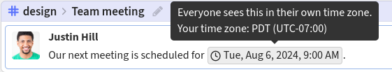
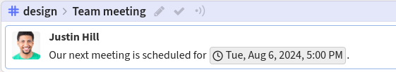

import ZulipTip from "../../components/ZulipTip.astro";

### What you type

A date picker will appear once you type `<time`.

```
Our next meeting is scheduled for <time:2024-08-06T17:00:00+01:00>.
```

The selected time is inserted into your Markdown message along with
your time zone (in ISO 8601 format).

### What it looks like

A person in San Francisco will see:



While someone in London will see:


