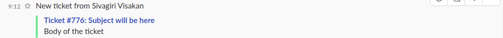
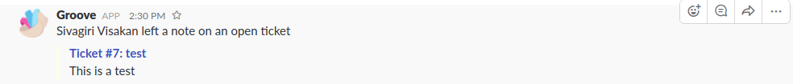
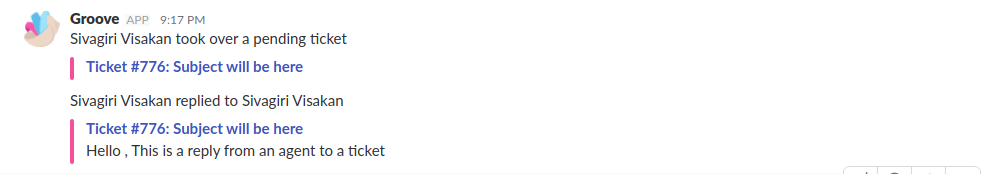
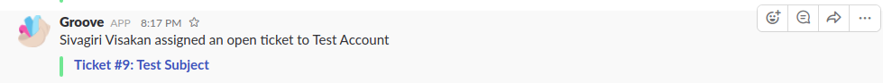

[Groove](https://www.groovehq.com/) is a help desk software for managing tickets opened by customers.

Groove already has integrations with Slack and also supports webhooks.
Groove can send out a notification in Slack for the following cases:
 - A ticket is created.
 - A ticket is assigned to an agent
 - A ticket is assigned to  a group
 - A customer replies to a ticket
 - An agent replies to a ticket
 - An agent leaves a note on a ticket
 - An agent forwards a ticket.
 - A collaborator replies to a forwarded ticket
 
Of these , there are no seperate webhooks available for the last two events. So we cannot have messages sent to Zulip for these cases.

 The events are distinguished by the `X_GROOVE_EVENT` header that is sent along with the webhook.
 
Webhook payloads don't give the names of agent or sometimes names of customers , only the emails,so we have to settle for showing the agent's or a customer's email instead of names (unless GET requests can be made from webhook's view.py to get the details of an agent or a customer from Groove's API.)
 
Also , it is not possible to distinguish from webhooks if the _ticket\_assigned_ event was triggered by assigning a ticket to group or to an agent as webhooks are only triggered for assigning to an agent.
So when writing code for the integration, the should to Zulip (assuming that _assigned\_group_ or _assignee_ is not `null` in the payload.) should be something like

```
Ticket #3 has been assigned to :
Group : <group name>
Agent : <agent email>
```
##### How Slack notifictions look





 ##### A few examples of how the messages can be sent to Zulip from webhook
 
 1. When a new ticket is opened
 ```
 New ticket has been opened for <customer name>
 [Ticket #<ticket no> <subject>](ticket URL)
 <message>
 ```
 2. When a ticket is assigned
 ```
Ticket #3 has been assigned to :
Group : <group name>
Agent : <agent email>
```
3. When a customer replies to a ticket
```
customer@example.com has replied to a ticket
Ticket #3
<replied message>
```
4. When agent replies to a ticket
```
agent@example.com has replied to a ticket
Ticket #3
<replied message>
```
5. A note is added to  a ticket
```
agent@example.com has left a note on a ticket
Ticket #4
<note message>
```
#### Terminology

 - `ticket` - a 'conversation' opened by a customer or by an agent
 - `agent` - a person who works for a business and answers the queries on a ticket.
 - `group` - a team of agents.
 - `note` -  an internal system that can be used within a ticket conversation for internal commnication with the business team that is not visible to  a customer
 

#### Links

Groove : https://www.groovehq.com/ 

Groove API docs : https://www.groovehq.com/docs 

Groove webhook docs : https://www.groovehq.com/docs/webhooks
